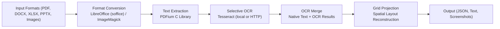

# LiteParse: Independent Source-Grounded Technical Review

This document provides an independent, source-grounded review of **liteparse** (npm package `@llamaindex/liteparse`), a tool utilized by this repository's `document-parser` skill (`/Users/mithushancj/.claude/skills/document-parser/SKILL.md`) to parse various document formats into layout-preserved text.

---

## 1. Naming & Vendor Correction

> [!IMPORTANT]
> **Clarification of Ownership**: LiteParse is developed and maintained by **LlamaIndex** (`github.com/run-llama/liteparse`), not Deepgram.
>
> The association with Deepgram in the repository's context arose solely because the `lit` CLI was recently used to parse a Deepgram-authored PDF ebook (`deepgram-voice-agent.pdf`). All references to "Deepgram LiteParse" should be updated to **LlamaIndex LiteParse** or simply **LiteParse**.

---

## 2. Architecture & Runtime Mechanism

LiteParse is designed as a local-first, lightweight document parser. Its implementation consists of a Node.js/TypeScript wrapper over a Rust native core (`crates/liteparse` in the public repository).

### 2.1 Component Layers
- **JS CLI Entrypoint** (`dist/cli.js`): Uses the `commander` package to define CLI commands, parse options, and handle file system I/O.
- **JS Library Wrapper** (`dist/lib.js`): Implements the user-facing `LiteParse` class, mapping TypeScript option objects to native bindings configurations.
- **Runtime Native Resolution** (`dist/native.js`): Resolves and loads the correct native `.node` platform-specific binary.
- **Native Types** (`dist/native.d.ts`): Outlines the typed signatures for the native bindings interface.
- **Rust Core & PDFium Addon** (`UNVERIFIED` in local npm package, `INFERRED` from public repository/README): Contains the C++ PDFium binding (`libpdfium.so` or `libpdfium.dylib`), format converters, OCR orchestrator, and grid projection algorithm.

### 2.2 Native Binary Loading Routine
The loader (`dist/native.js:10-68`) performs the following platform resolution logic:
1. Maps platform-architecture strings to optional NPM package dependencies (`dist/native.js:12-20`):
   - `darwin-x64`: `@llamaindex/liteparse-darwin-x64`
   - `darwin-arm64`: `@llamaindex/liteparse-darwin-arm64` (used on Apple Silicon macOS hosts)
   - `linux-x64-gnu`: `@llamaindex/liteparse-linux-x64-gnu`
   - `linux-x64-musl`: `@llamaindex/liteparse-linux-x64-musl`
   - `linux-arm64-gnu`: `@llamaindex/liteparse-linux-arm64-gnu`
   - `linux-arm64-musl`: `@llamaindex/liteparse-linux-arm64-musl`
   - `win32-x64-msvc`: `@llamaindex/liteparse-win32-x64-msvc`
2. Pushes candidates based on the runtime `process.platform` and `process.arch` (`dist/native.js:25-35`).
3. Attempts to load candidates using the platform-specific package (`dist/native.js:36-46`).
4. Falls back to checking local directories (`__dirname`, parent folders) for pre-compiled `.node` binary files (e.g. `liteparse.node` or `liteparse.<platform>-<arch>.node`) (`dist/native.js:47-65`).
5. Throws a runtime error if no platform-matching library or fallback is successfully required (`dist/native.js:66-67`).

### 2.3 Core Processing Pipeline (`INFERRED` from public README)
When parsing non-PDF files, the Rust core runs external commands to convert files before passing them to the layout extraction engine:


---

## 3. CLI Surface & Discrepancies

### 3.1 CLI Options Breakdown (Source: `dist/cli.js`)
LiteParse defines three primary subcommands under the `liteparse` (or `lit`) CLI:

#### A. `parse` (`dist/cli.js:11-85`)
Parses a single document.
- **Argument**: `<file>` (Path to target file)
- **Options**:
  - `-o, --output <file>`: Output file path (defaults to writing to `process.stdout`).
  - `--format <format>`: Output format: `json` or `text` (defaults to `"text"` via `dist/cli.js:59-60`, overriding the library's default `"json"` defined in `dist/lib.js:34`).
  - `--ocr-server-url <url>`: URL of an external HTTP OCR server.
  - `--no-ocr`: Disables OCR (mapped to `config.ocrEnabled = false` in `dist/cli.js:40-41`).
  - `--ocr-language <lang>`: Language code for Tesseract (defaults to `"eng"` in `dist/lib.js:27`).
  - `--max-pages <n>`: Truncate parsing at $N$ pages (library default is `1000` via `dist/lib.js:31`).
  - `--target-pages <pages>`: String range of pages to parse (e.g., `"1-5,10,15-20"`).
  - `--dpi <dpi>`: Rendering resolution DPI (library default is `150` via `dist/lib.js:33`).
  - `--preserve-small-text`: Keeps small text layers (maps to `config.preserveVerySmallText = true` in `dist/cli.js:50-51`).
  - `--password <password>`: Password for encrypted PDFs.
  - `--config <file>`: Load configuration options from a JSON file (`dist/cli.js:31-34`).
  - `-q, --quiet`: Suppress CLI progress and warnings.
  - `--num-workers <n>`: Number of concurrent OCR threads (library default is `1` via `dist/lib.js:38`).

#### B. `screenshot` (`dist/cli.js:86-138`)
Renders target document pages as PNG images.
- **Argument**: `<file>`
- **Options**:
  - `-o, --output-dir <dir>`: Directory where screenshots are saved (defaults to `"./screenshots"`).
  - `--target-pages <pages>`: Specific page numbers or ranges (e.g., `"1-3"`). Note that the JS side parses this option into an array `pageNumbers` (`dist/cli.js:107-122`) before passing to the library wrapper.
  - `--dpi <dpi>`: Resolution DPI for the rendered screenshots.
  - `--password <password>`: PDF password.
  - `-q, --quiet`: Suppress progress logs.

#### C. `batch-parse` (`dist/cli.js:139-233`)
Processes multiple documents from an input directory.
- **Arguments**: `<input-dir>`, `<output-dir>`
- **Options**:
  - All standard parsing options (`--format`, `--no-ocr`, `--ocr-language`, `--ocr-server-url`, `--max-pages`, `--dpi`, `--password`, `-q`, `--num-workers`).
  - `--recursive`: Recursively processes child directories.
  - `--extension <ext>`: Filter batch to files ending with the specified extension (e.g., `.pdf` or `pdf`).

### 3.2 Key Discrepancies between Sources
1. **Default Format Divergence**: The API library `dist/lib.js:34` defaults to `"json"`, whereas the CLI wrapper `dist/cli.js:59-60` overrides the default to `"text"`.
2. **Missing `--target-pages` in Batch Mode**: The `batch-parse` command lacks support for the `--target-pages` flag. If page targeting is required, individual `lit parse` operations must be executed.
3. **Option Name Mapping**: The CLI flag `--preserve-small-text` maps internally to the JS/Native parameter `preserveVerySmallText` (`dist/cli.js:50-51`).
4. **Undocumented CLI Flags in `SKILL.md`**:
   - `--config <file>`: Unmentioned in the skill file, despite being useful for loading standardized parameters.
   - `--ocr-server-url <url>`: Omitted in the skill file, leaving developers unaware of the ability to offload local CPU OCR to remote endpoints.
   - `--num-workers <n>`: Not explicitly detailed as an optimization flag for CPU-bound local Tesseract runs.
5. **Additional Supported Formats**: `cli.js:234-241` lists `.txt`, `.md`, `.markdown`, and `.log` as supported extensions. `SKILL.md:6-10` only references PDFs, DOCX, XLSX, PPTX, and images.

---

## 4. Strengths & Limits

### 4.1 Grounded Strengths
- **Speed**: Parsing the digital PDF `deepgram-voice-agent.pdf` (107 pages) took only **146 ms** (approx. **1.36 ms per page**).
- **Privacy & Connectivity**: Local execution ensures no data leaves the host system, eliminating external API latency and keys.
- **Layout Preservation**: Grid projection reconstructs multi-column and tabular layouts visually, inserting spaced blocks to mimic document columns.

### 4.2 Grounded Limits
- **LLM Reading Order Garbling**: Reconstructing layout via spaces poses a serious semantic threat to LLMs. Because models process text line-by-line horizontally, side-by-side columns are read interleaved.
  *Example (`research-notes/deepgram-voice-agent.txt:60-63`)*:
  ```text
  Why Voice Agents     Now                                                              About This     Guide
  Voice is no longer a novelty in human–computer interaction. It has become a           This guide is Deepgram's definitive, opinionated playbook for designing,
  ```
  The LLM reads this horizontally: *"Why Voice Agents Now About This Guide Voice is no longer a novelty in human-computer interaction. It has become a This guide is Deepgram's..."*. This splits and interweaves distinct columns.
- **OCR Dependencies**: Local OCR requires a system-level Tesseract installation and compiled language training data (`tessdata`). Without it, enabling OCR causes startup crashes.
- **Office & Image Conversions**: Office formats depend on LibreOffice (`soffice` binary in system PATH), and image formats depend on ImageMagick. If these external commands fail or are missing, parsing fails.

---

## 5. Practical Learnings

1. **Prefer `--format json` for Tables & Bboxes**: For extracting key-value pairs or multi-column data, JSON format outputs individual `textItems` with bounding boxes (`x`, `y`, `width`, `height`). This lets scripts reconstruct columns sequentially.
2. **Strictly Control `--no-ocr`**: Default to `--no-ocr` on digital documents to avoid the cold-start overhead of local Tesseract and prevent crashes when language data is missing.
3. **Use `--target-pages` on Large Documents**: Big files consume significant memory during rendering and PDFium parsing. Limit extraction to specific page sequences whenever possible.
4. **Leverage `screenshot` for Visual Elements**: Charts, flow diagrams, and complex graphics are entirely skipped or rendered as disjointed text blocks in plain text extraction. Use `screenshot` to generate PNGs of these pages and pass them to multimodal vision models.

---

## 6. Proposed Improvements to Repository Wrapper

To enhance how the repository's `document-parser` skill (`/Users/mithushancj/.claude/skills/document-parser/SKILL.md`) wraps and invokes LiteParse, we recommend the following updates:

### 6.1 Update `SKILL.md` to Document Hidden Capabilities
- Include `--config <file>` and `--ocr-server-url <url>` flags under the "Other flags worth knowing" section.
- Explicitly note that `.txt`, `.md`, and `.log` formats can be passed directly as input.
- Clarify that `--target-pages` is invalid for `batch-parse` commands.

### 6.2 Implement JSON Reconstruction Guidelines
Add a section explaining how to handle multi-column documents to avoid interleaved text reading issues:
```markdown
### Multi-Column Reading Order Mitigation
To prevent LLM confusion from side-by-side columns, parse the document to JSON:
`lit parse report.pdf --format json --no-ocr -o report.json`
Then, sort textItems by bounding box coordinates (`x` and `y`) to isolate columns and read them top-to-bottom sequentially.
```

### 6.3 Document Container Portability Requirements
Because the repository is deployed inside Linux containers (e.g. Dockerfiles for spikes or production), add a warning about prebuilding native binaries:
- Specify that runtime execution requires matching system packages. If built on macOS but targeting Linux, the `npm install` pipeline must pull the platform-specific dependency (e.g., `@llamaindex/liteparse-linux-x64-gnu`).
- Note that `LibreOffice` and `ImageMagick` must be pre-installed inside the Dockerfile to support Office/Image conversions.

### 6.4 Version Pinning
Ensure `@llamaindex/liteparse` is locked to version `2.0.3` in all scripts and setups to prevent breaking changes with upstream CLI modifications.
