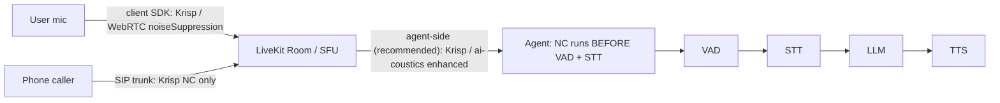
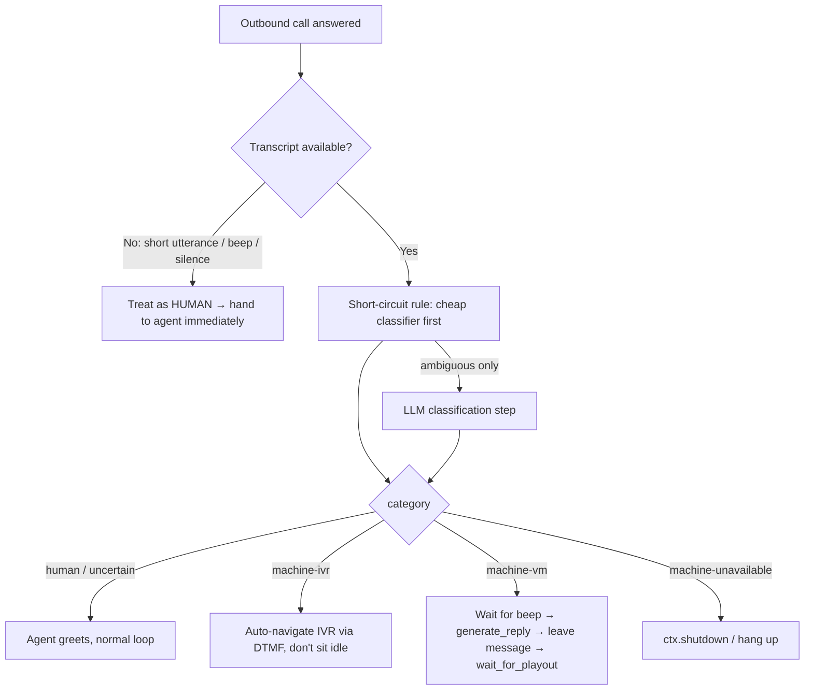

# LiveKit latency + audio-quality + telephony cluster vs Syrinx

Status: Research synthesis. Sources: 6 LiveKit blog posts (fetched via Firecrawl 2026-07-21, cached
2026-07-20/21) + Syrinx source (cited `file:line`). LiveKit's inline mermaid diagrams render
client-side ("Loading diagram…") and did **not** come through the scrape — the diagrams below are
reconstructed from the posts' prose and flagged as such.

## Sources

| # | Post | Published | Key claim |
|---|---|---|---|
| 1 | [understand-and-improve-agent-latency](https://livekit.com/blog/understand-and-improve-agent-latency) | 2026-04-13 | Latency playbook + priority order |
| 2 | [noise-cancellation](https://livekit.com/blog/noise-cancellation) | 2026-06-10 | Where NC runs, models, cost |
| 3 | [answering-machine-detection](https://livekit.com/blog/answering-machine-detection) | 2026-05-13 | AMD routing: human/voicemail/IVR/unavailable |
| 4 | [why-webrtc-beats-websockets-for-voice-ai-agents](https://livekit.com/blog/why-webrtc-beats-websockets-for-voice-ai-agents) | 2026-03-23 | Transport argument |
| 5 | [real-time-voice-agents-vs-model-apis](https://livekit.com/blog/real-time-voice-agents-vs-model-apis) | 2026-03-17 | Don't build on raw model realtime APIs |
| 6 | [realtime-vs-cascade](https://livekit.com/blog/realtime-vs-cascade) | 2026-04-17 | Pipeline vs S2S tradeoffs |

---

## Theses

1. **LiveKit and Syrinx agree on the diagnosis, differ on the transport bet.** Both say: the LLM
   leg dominates voice latency; you must *measure per-stage* before optimizing; streaming overlap
   between stages is what makes a cascade competitive. LiveKit's answer to transport is WebRTC + a
   distributed SFU. Syrinx's is WebSocket-only (Twilio/Telnyx/SmartPBX/CF/browser-Opus). For
   Syrinx's actual deployment surface (PSTN telephony + a single browser leg), the WebRTC gap is
   **real for the browser leg and largely moot for the carrier leg** (see Q4).

2. **LiveKit corroborates two Syrinx findings directly.** (a) Its "preemptive generation" is
   exactly Syrinx's `speculative` Lever-D, *including the same caveat* that regeneration on divergent
   final transcripts wastes tokens — Syrinx measured this to the count (13 discarded drafts on a
   per-interim endpointer). (b) Its "Thinking sound / notify before the tool call" tactic is the
   generic form of Syrinx's tool-preamble finding (TTFA 3813/4114 ms → 1404/1732 ms).

3. **Syrinx is ahead on measurement granularity and half-cascade framing; behind (by absence) on
   two shipped LiveKit product features: enhanced noise cancellation and AMD.** Both are *declared
   seams or plain gaps* in Syrinx today. This doc extracts the concrete adopt path for each.

---

## Q1 — Latency: priority order + numbers

### LiveKit's attack order (post #1, "Latency improvement playbook", verbatim TL;DR)

1. **Monitor performance** — use Agent Observability to find which stage (STT/LLM/TTS/tools/network)
   dominates. *Measure first.*
2. **Agent–model co-location** — host the agent in the same region as STT/LLM/TTS; if SIP, keep the
   trunk geographically close. Rated **"Very high"** impact — the single most impactful step.
3. **Evaluate faster models** — swap a smaller/newer model in the dominant stage. Rated **"High"**.
4. **Tooling hygiene** — cap `max_tool_steps`, consolidate external API calls, play a "thinking"
   sound so users aren't waiting in silence. Rated **"Potentially high"**.

Per-source impact ratings worth noting: geographic co-location = Very high; model choice = High;
STT/TTS model-specific config = Low; prompt/context size = Likely low; **noise cancellation =
Negligible latency impact**; SIP = "limited to RTT + small jitter/transcode allowance".

**Numbers LiveKit gives:** the post is deliberately number-light ("any recommendations… will
quickly go out of date"). The only hard latency figures in the cluster are the AMD post's **P50
time-to-detection 840 ms** (post #3) and the WebRTC post's **Singapore↔US-East ~230–280 ms RTT**
network-physics figure (post #4). No per-stage budget table anywhere — this is the gap Syrinx's
`docs/latency-budget.md` fills.

### Syrinx's decomposition (measured, not rated)

Syrinx emits a per-turn `turn_latency` event decomposed into named stages
(`packages/core/src/voice-agent-session.ts:222-245`, computed at `:1022-1067`):

```
ttfaMs = eouDelayMs + llmTtftMs + textAggregationMs + ttsTtfbMs + unattributedMs
```

with `fillerUsed` / `backchannelUsed` flags so any TTFA quoted off a turn where a preamble/filler
spoke first is *marked as time-to-acknowledgement, not latency* (`:244-245`, `:1039-1054`) — a
confound-guard LiveKit's prose gestures at ("thinking sound") but does not instrument.

Budget targets (`docs/latency-budget.md`): STT-final ≤300 ms P95, LLM-TTFT ≤500 ms (the declared
**bottleneck**, measured ~1.3 s and as high as ~3.3 s), TTS-TTFB ≤300 ms, **v2v ≤800 ms P95 /
≤1500 ms P99**.

### Corroboration — where LiveKit confirms a Syrinx finding

| Syrinx finding (`docs/latency-budget.md` / notes) | LiveKit analogue (post #1) | Verdict |
|---|---|---|
| LLM-TTFT is the dominant leg; speech stages within budget | "TTFT varies significantly by model… use Observability to find the dominant stage" | ✅ same diagnosis |
| Tool preamble cut TTFA 3813/4114 → 1404/1732 ms; **tools aren't the cost, extra inference passes are** | "function tools… happen before the reply… play a 'Thinking' sound… notify the user prior to the call" + `max_tool_steps` | ✅ same tactic; Syrinx quantifies it |
| `speculative` Lever-D only helps with a confidence-gated eager endpointer; net-harmful on per-interim (13 drafts discarded, 0 promoted) | "Preemptive generation… if the system needs to regenerate following the final transcript, latency will not be improved… wastes LLM tokens" | ✅ **same caveat, independently reached** |
| Hedging cuts the tail −59% (worst 6580 → 2725 ms) | (not covered — LiveKit has no hedging tactic in the cluster) | Syrinx ahead |
| Prompt/context bloat inflates TTFT | "larger prompts… TTFT typically grows… trim/summarize older turns" | ✅ agree |

**Net:** LiveKit corroborates Syrinx's *"measure per-stage, LLM leg dominates, speculative-start
has a divergence tax"* thesis but offers **no competing per-stage budget numbers** — Syrinx's
decomposition is the more rigorous artifact. Syrinx's hedging lever has no LiveKit counterpart.

---

## Q2 — Noise cancellation: the adopt path for Syrinx's EMPTY denoise seam

### What LiveKit does (post #2)

**Where it runs — three placements:**



- **Recommended default for voice AI = agent-side**, on *inbound* audio, before VAD/STT. Cleaner
  input → better VAD + turn detection (NC runs *before* those stages).
- **Do not stack enhanced models** — Krisp and ai-coustics are trained on *raw* audio; feeding one
  another's output produces "unexpected results". If NC is on the agent, don't also enable Krisp on
  frontend or trunk.
- **Two flavors, priced differently:**

| Flavor | Removes | Models | Cost |
|---|---|---|---|
| Background noise suppression | non-speech noise; keeps all speech | Krisp NC, ai-coustics QUAIL_L | **Included** with LiveKit Cloud, no surcharge |
| Voice isolation | competing voices + noise; keeps only primary speaker | Krisp BVC, Krisp **BVCTelephony**, ai-coustics QUAIL_VF_S/L | **Metered** (billed separately, free allowance) |

- **Latency/cost of NC itself:** "runs with **negligible impact on audio latency or quality**"
  (post #1). "CPU- and memory-intensive" server-side (post #2). LiveKit gives **no WER or
  millisecond numbers** in these posts — it defers to its docs for WER. **So the Telnyx "<20 ms /
  43% WER-improvement" figures in the task have NO LiveKit-published equivalent to compare against —
  flag as unverified from this source.**
- **Telephony wrinkle:** `BVCTelephony` is Krisp's voice-isolation model tuned for the narrow 8 kHz
  G.711 phone band. A voice-isolation model that locks onto the *primary* speaker will mis-fire when
  the "primary" it first locked was an IVR/answering machine ("Call audio goes very quiet after an
  answering machine or IVR… do not use a voice isolation model in this scenario" — troubleshooting
  table). This directly couples NC choice to AMD (Q3).

### Syrinx today — the seam is DECLARED BUT EMPTY (confirmed)

- Packet types exist: `DenoiseAudioPacket` (`kind: "denoise.audio"`) and `DenoisedAudioPacket`
  (`kind: "denoise.result"`, carries `noiseReduced: boolean`, `confidence: number`) —
  `packages/core/src/packets.ts:136-146`, in the union at `:614-615`.
- Init ordering knows the stage: `pluginStage()` maps `"denoiser"|"rnnoise" → InitStage.Denoiser`
  (`packages/core/src/init-stage-order.ts:27-29`), ordered at `:62-63`, counted as an audio stage
  at `:77`. Component tag `"denoiser"` exists (`packets.ts:49`, `:81`).
- **Zero producers.** No package under `packages/` denoises (grep: no `denois*`/`rnnoise` package;
  no emitter of `denoise.result`/`DenoisedAudioPacket` outside the type decl + re-export). The seam
  is a wired-but-unpopulated slot.

### Concrete adopt path (mirrors LiveKit's shape onto Syrinx's seam)

1. **New plugin package** `packages/rnnoise` (or `packages/denoise`) implementing the plugin
   contract, registered under name `"rnnoise"`/`"denoiser"` so `pluginStage()` already slots it at
   `InitStage.Denoiser` (order 100) — **no core change needed to place it**; it initializes as an
   audio stage.
2. **Producer**: consume `VadAudioPacket`/inbound PCM, emit `DenoisedAudioPacket` with
   `noiseReduced` + `confidence` already in the contract. Run it **before VAD/STT** in the chain —
   Syrinx's stage order (`Denoiser` = 100 vs STT = 60) governs *init* order, not runtime packet
   order, so the chain wiring must route denoised audio into STT/VAD explicitly (verify in
   `voice-agent-session` chain assembly).
3. **Model choice, telephony-first (Syrinx is PSTN-dominant):** the LiveKit lesson is that
   *voice-isolation on telephony needs a telephony-tuned model and interacts with AMD*. For a v1,
   **background noise suppression (RNNoise-class / QUAIL_L-equivalent) is the safe default** — it
   keeps all speech and cannot mis-lock onto an IVR. Reserve voice-isolation for a later, AMD-gated
   config. Ship background-suppression first, exactly as LiveKit's "included, no surcharge, safe for
   multi-speaker" tier.
4. **Don't stack**: if a CF/edge or carrier-side denoiser is ever enabled, gate the Syrinx denoiser
   off — replicate LiveKit's no-double-enhance rule as a config guard.
5. **Latency budget**: LiveKit calls NC latency "negligible"; Syrinx's `latency-is-top-priority`
   rule means the new stage must be gated on **LLM-TTFT unchanged vs baseline** and add ~0 to
   `ttfaMs` — measure via the existing `turn_latency` decomposition. (Note: server-side NC is
   CPU-heavy per LiveKit; on Workers/edge this is a real cost to benchmark, not assume.)

---

## Q3 — AMD routing: the exact shape Syrinx's missing hook should take

### LiveKit's AMD (post #3) — confirmed ABSENT in Syrinx

Grep across `packages/**/*.ts`: **zero** hits for `voicemail | answering machine | AMD | beep
detect`. Syrinx has no AMD. This is a clean gap, not a seam.

**LiveKit's routing logic** — classify every outbound call into one of four categories, then branch:



Design principles worth copying verbatim:
- **Runs OUTSIDE the agent's main loop** — "your agent prompt shouldn't be stuffed with detection
  logic". A separate `AMD(session)` object you `await detector.execute()` on.
- **Short-circuit before the LLM** — cheap rule handles easy cases; only ambiguous ones pay a model
  call. Transcript, when available, is the strongest signal.
- **Bias toward HUMAN on no-transcript** — "misclassifying a human as a machine is the worst-case
  failure mode." A one-word "hello?" → treat as human, reply instantly (keeps TTFR fast).
- **Timing, not just detection** — leave the voicemail *after the beep*, start IVR nav *after the
  prompt*; "interruption protection" stops the agent talking over a beep.
- **Numbers:** default `google/gemini-3.1-flash-lite` + `cartesia/ink-whisper`. F1: human 95.7%,
  IVR 98.2%, voicemail 97.3%, macro 97.0%, micro/accuracy 94.7%. **P50 time-to-detection 840 ms**,
  measured session-start → verdict; with preemptive generation the first human reply is drafted in
  parallel so it fires the moment AMD confirms a human.

### Shape for Syrinx's AMD hook

Syrinx already has the substrate to do this cleanly:
- **It's telephony-native** — `packages/server-websocket/src/{twilio,telnyx,smartpbx}.ts` own the
  outbound-call leg where AMD must run. AMD belongs at the transport-host layer, not in the reasoner
  prompt (matches LiveKit's "outside the main loop").
- **DTMF for IVR nav** — needs a DTMF-send path on the Twilio/Telnyx transports (verify presence;
  likely a gap to fill alongside AMD).
- **Reuse the existing STT + a cheap classify Reasoner** — Syrinx already has `RoutingReasoner`
  (`packages/core/src/reasoner-route.ts:20`, `classify(turn)` at `:14`) whose *exact pattern* — a
  cheap classifier gating an expensive path with a `route.mispredict` metric (`:67`) — is the
  short-circuit-rule-then-LLM shape AMD needs. An AMD classifier is a specialized `RoutingReasoner`
  route set (`human | machine-ivr | machine-vm | machine-unavailable | uncertain`).
- **Bias-to-human + preamble** — Syrinx's `fillerUsed`/`backchannelUsed` timing already models
  "speak something before you're sure"; the AMD "reply instantly on hello?" behavior reuses it.

Minimal v1: an `AmdDetector` at the outbound transport host that (1) short-circuits to HUMAN on
no-transcript, (2) routes available transcripts through a cheap classify route, (3) exposes the four
branches to the session (greet / leave-VM-after-beep / IVR-DTMF / hang-up). Couple it to NC (Q2):
disable voice-isolation NC while AMD is undecided to avoid the "quiet after IVR" mis-lock.

---

## Q4 — WebRTC vs WebSocket: real limitation for Syrinx, or moot on PSTN? (balanced)

### LiveKit's argument (posts #4, #5)

WebSocket = TCP → **head-of-line blocking** (one lost packet stalls the stream 100s of ms, then a
buffered burst), no media timing / jitter buffer, TCP congestion control (fill-and-backoff) wrong
for steady audio, window shrinks on loss. WebRTC = UDP/RTP (lost 20 ms frame ≈ imperceptible),
built-in adaptive jitter buffers, media-aware congestion control (GCC), codec negotiation, and
**AEC/AGC/noise-suppression in the client media pipeline before audio hits the network**. Plus SFU
benefits (connect-once fan-out, simulcast, observability, multi-region). Post #5 adds: raw model
realtime APIs are WebSocket-based and hand you *none* of transport/AEC/turn-detection/client-SDKs.

### Is it a real limitation for Syrinx? — depends on the leg

Syrinx is **WebSocket-only** (`packages/server-websocket/src/`: `twilio.ts`, `telnyx.ts`,
`smartpbx.ts`, `browser-opus.ts`, `edge.ts`; no WebRTC/SFU anywhere).

**On the PSTN/telephony leg — largely MOOT.** The head-of-line-blocking argument is about the
*media path between the endpoint and the server*. On a phone call, that path is the **carrier's
PSTN/SIP network**, which does its own QoS/jitter management and hands Syrinx a already-buffered
G.711 8 kHz RTP-over-SIP stream at the trunk (Twilio/Telnyx media stream → WebSocket). The
WebSocket here is **server-to-server (carrier media-stream API → Syrinx)**, typically same-region,
low-loss — not the lossy last-mile WebRTC is built for. LiveKit itself concedes SIP latency is
"generally limited to RTT + a small jitter/transcode allowance" (post #1) and that **it too uses
WebSockets for the signaling leg**. AEC is also moot on PSTN: the phone handset/carrier does echo
control, and there's no speaker-into-mic loopback on a normal call the way there is for a browser on
speakerphone. **Verdict: for the carrier leg, WebSocket is a reasonable transport and the WebRTC
advantages mostly don't apply.**

**On the browser leg — REAL.** `browser-opus.ts` is a browser client talking to Syrinx over
WebSocket. Here the last-mile *is* consumer internet, and every LiveKit argument bites: HOL
blocking on packet loss, no jitter buffer (Syrinx ships a client `AudioJitterBuffer` ~100 ms per
`latency-budget.md` — a *partial* hand-rolled version of what WebRTC gives free), no built-in
**AEC** (a browser on speakerphone genuinely needs it — this is the strongest gap), no GCC. Syrinx
mitigates with Opus + paced playout (`paced-playout.ts`, `outbound-playout-pipeline.ts`) but is
re-solving, partially, what WebRTC solved. **Verdict: for the browser leg, WebSocket is a genuine
limitation — AEC especially.**

**Balanced bottom line:** LiveKit's post is transport-vendor advocacy (it sells the SFU), and it
over-generalizes "WebSockets fall apart in production" to *all* voice. For Syrinx's dominant surface
(PSTN via carrier media streams), the carrier absorbs the QoS problem and the critique is mostly
moot. For the browser surface, the critique lands — chiefly on AEC and jitter — and is worth
either a WebRTC ingress option or continued investment in the hand-rolled jitter/echo path. It is
**not** an argument against Syrinx's architecture wholesale; it's a targeted gap on one leg.

---

## Q5 — Where Syrinx is ahead

1. **Half-cascade is a first-class, shipped mode — and Syrinx's framing beats LiveKit's.** LiveKit
   frames half-cascade as *only* "realtime model for audio-input + separate TTS" (post #6 "best of
   both worlds"; post #1 rates it "Low–Medium impact, you *lose* some realtime latency advantage").
   Syrinx implements exactly that path — `packages/realtime/src/realtime-bridge.ts:93` (text-only
   mode streaming assistant transcript into the cascade), `realtime-adapter.ts:24-25`
   (`modalities:["text"]` capability) — **and** treats cascade / native-realtime / half-cascade as
   three co-equal configs at one seam, not a reluctant hybrid. Syrinx also carries measured
   half-cascade decomposition and a `docs/interaction-thesis-results.md` A/B, which LiveKit's
   qualitative summary table lacks. **Syrinx's half-cascade beats both framings by being measured
   and seam-native rather than a documented workaround.**

2. **Per-turn latency decomposition with confound guards.** Syrinx's `turn_latency`
   (`voice-agent-session.ts:222-245`) attributes every turn to
   `eouDelay/llmTtft/textAggregation/ttsTtfb/unattributed` with `fillerUsed`/`backchannelUsed`
   flags. LiveKit exposes `e2e_latency` + LLM-TTFT + TTS-TTFB per `ChatMessage` (post #1) but has
   **no published per-stage budget, no unattributed residual, and no filler/backchannel confound
   flag**. Syrinx's honesty guard ("a number quoted from a preamble turn is time-to-ack, not
   latency") is more rigorous than anything in the cluster.

3. **Reasoner-level latency levers LiveKit doesn't have.** `HedgedReasoner`
   (`reasoner-hedge.ts:40`, `hedgeAfterMs`) cuts the tail −59% (measured); `RoutingReasoner`
   (`reasoner-route.ts:20`) does fast/deep model routing with a `route.mispredict` metric; the
   composed `route→hedge→speculative` config is drop-in at `withVoice({ reasoner })`. LiveKit's
   playbook stops at "pick a faster model" + "preemptive generation" — no hedging, no
   per-turn routing seam.

4. **IU (Incremental Unit) substrate.** Syrinx's `iu_ledger` component + `speculative` flag over an
   add/commit/revoke ledger unifies speculative-gen + barge-in truncation + turn-epoch into one
   primitive (project memory: incremental-unit-substrate-insight). LiveKit's "preemptive
   generation" is a single boolean with the divergence caveat but no ledger/revoke model behind it.

**Where LiveKit is ahead (fair statement):** shipped enhanced NC (Krisp/ai-coustics, agent-side,
negligible latency) and shipped AMD (97% macro-F1, 840 ms P50) — both are gaps/empty-seams in
Syrinx (Q2, Q3). And WebRTC+SFU transport for the browser leg (Q4). These are product-surface
features Syrinx should adopt, not architectural superiority.

---

## Consolidated comparison table

| Dimension | LiveKit (cluster) | Syrinx (cited) | Edge |
|---|---|---|---|
| Latency method | Observability finds dominant stage; qualitative impact ratings | `turn_latency` per-stage decomposition + budget table + confound flags | **Syrinx** (rigor) |
| Latency priority | co-locate > faster model > tooling hygiene | LLM-TTFT is bottleneck; speculative/hedge/route/preamble | agree on diagnosis |
| Speculative start | "preemptive generation" + regeneration caveat | Lever-D `speculative`; measured 13-discard failure on per-interim | **Syrinx** (quantified, same caveat) |
| Hedging | — (none) | `HedgedReasoner` −59% tail (measured) | **Syrinx** |
| Model routing | "pick a faster model" | `RoutingReasoner` fast/deep + `route.mispredict` | **Syrinx** |
| Noise cancellation | Shipped: Krisp + ai-coustics, agent-side, negligible latency, tiered pricing | Seam declared (`DenoiseAudioPacket`) — **zero producers** | **LiveKit** |
| AMD / voicemail / IVR | Shipped: 4-way routing, 97% macro-F1, 840 ms P50, DTMF IVR nav | **None** (grep: 0 hits) | **LiveKit** |
| Transport | WebRTC/UDP + distributed SFU | WebSocket-only (Twilio/Telnyx/SmartPBX/CF/browser-Opus) | LiveKit for browser; **moot for PSTN** |
| AEC | Built into WebRTC client pipeline | None (hand-rolled jitter buffer only) | **LiveKit** (browser leg) |
| Half-cascade | Documented hybrid ("lose some realtime advantage") | Seam-native + measured (`realtime-bridge.ts:93`) | **Syrinx** (framing + measurement) |
| Realtime/cascade/half | supports all 3 via Inference | supports all 3 (`packages/realtime`, cascade, half-cascade) | tie |
| Per-stage budget numbers | none published in cluster | full P50/P95/P99 table (`docs/latency-budget.md`) | **Syrinx** |

---

## Numbers reproduced (from the sources)

- AMD (post #3): default `gemini-3.1-flash-lite` + `cartesia/ink-whisper`; F1 human **95.7%**, IVR
  **98.2%**, voicemail **97.3%**, macro **97.0%**, micro/accuracy **94.7%**; **P50 time-to-detection
  840 ms**. Available `livekit-agents` Python 1.5.9 / Node 1.4.2.
- WebRTC (post #4): Singapore↔US-East great-circle ~15,000 km → ~150 ms RTT theoretical, **230–280
  ms actual**; 720p@1.5 Mbps ≈ 50× audio bandwidth.
- NC (post #2): background suppression = **included/no surcharge**; voice isolation = **metered**
  (free allowance then paid). NC latency = **"negligible"** (post #1). **No WER/ms numbers
  published in these posts** — Telnyx's <20 ms / 43% WER claim has no LiveKit equivalent here
  (unverified from this source).
- Syrinx (`docs/latency-budget.md`, measured): v2v P50 ~2.1–3.6 s (LLM-dominated); LLM-TTFT P50
  ~1280 ms (as high as ~3290 ms mean on gpt-4.1-mini); STT-final P50 ~314–530 ms; TTS-TTFB P50
  ~270–530 ms. Hedge: worst-case 6580 → 2725 ms (−59%). Tool preamble: TTFA 3813/4114 → 1404/1732
  ms. Speculative on per-interim endpointer: 13 drafts started, 13 discarded, 0 promoted.

## Flags / unverified

- LiveKit's inline mermaid diagrams (SIP topology, NC placement, `amd_workflow.svg`) render
  client-side and were **not** captured; the two mermaid blocks above are **reconstructed from
  prose**, not LiveKit's originals.
- LiveKit publishes **no WER or per-stage millisecond budget** in this cluster — the Telnyx
  <20 ms/43% comparison cannot be made against LiveKit from these sources.
- Syrinx chain *runtime* packet routing for a future denoiser (vs *init* order) was not traced to
  the exact chain-assembly line — the adopt path assumes the denoiser must be wired ahead of STT/VAD
  in `voice-agent-session` chain assembly; verify before implementing.
- AMD DTMF-send capability on Twilio/Telnyx transports was not confirmed present — likely a
  co-requisite gap to fill alongside AMD.
