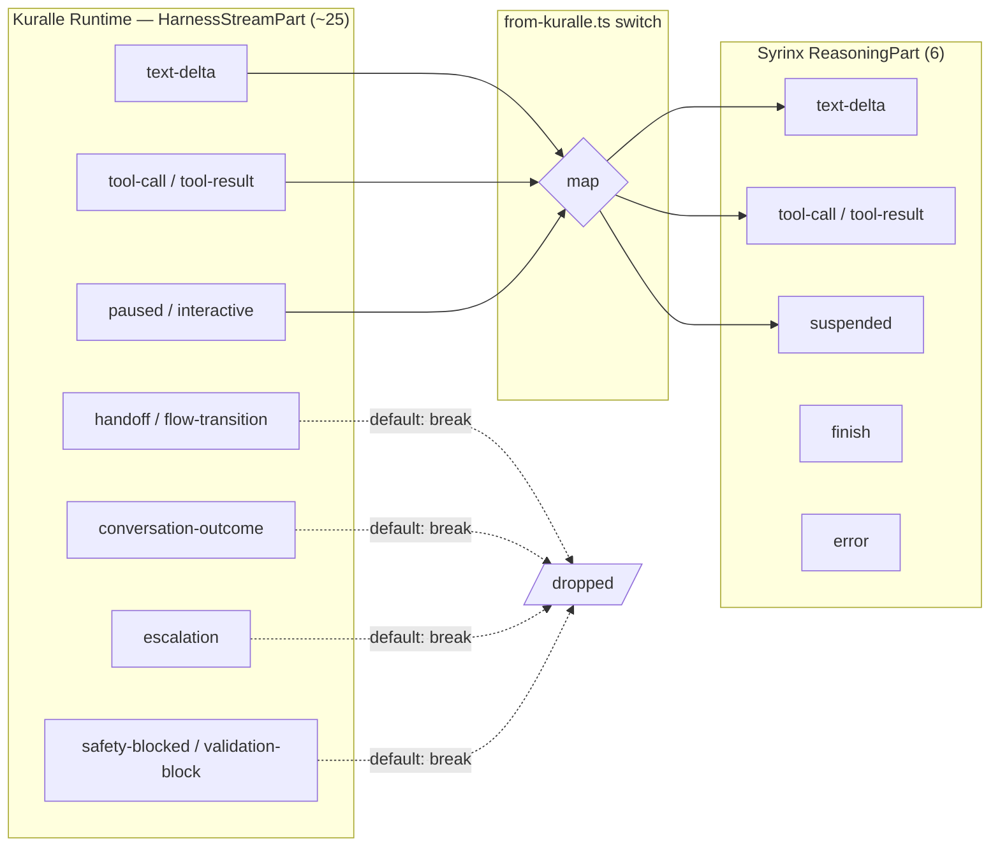

# LiveKit Multi-Agent Orchestration vs. Syrinx + Kuralle

**Status:** Ready for review — analysis complete, code-grounded.
**Question:** Is LiveKit's multi-agent orchestration surface something Syrinx should *build*, or does adopting **Kuralle-as-reasoner** already deliver most of it — leaving Syrinx to just *surface* the handoff / suspend / outcome parts through its bridge?

**Bottom line (build vs surface):** **Surface, don't build.** Kuralle already implements every one of LiveKit's five orchestration patterns natively (routing/handoffs, flows/consultation, needs-approval + resume-from-escalation, moderators/guardrails, typed flow collection). Syrinx's Reasoner seam deliberately normalizes a backend to **six** `ReasoningPart` types, and its Kuralle bridge (`from-kuralle.ts`) **maps only 7 of Kuralle's ~25 stream parts and silently drops the rest via `default: break`** — including `handoff`, `conversation-outcome`, `escalation`, and `safety-blocked`. The orchestration is *running underneath*; Syrinx just isn't emitting it. The only genuine *build* items are (a) the realtime front cannot handle suspend/resume (structural — the provider owns the turn), and (b) a human warm-transfer transport, which is an app/telephony concern, not an engine one.

> **Note on mermaid (flagged):** The six LiveKit posts contain **no `mermaid` fences** — their content is prose + comparison tables + Python code snippets. There were no verbatim diagrams to reproduce. The mermaid below is **authored** to visualize each pattern and the Syrinx bridge mapping; LiveKit's own code/tables are reproduced verbatim where load-bearing.

---

## The seam under test

Syrinx reduces any reasoning backend to one normalized pull-stream per turn. The **entire** normalized vocabulary is six parts (`packages/core/src/reasoner.ts:49-69`):

```
text-delta | tool-call | tool-result | suspended | error | finish
```

There is **no** union member for agent handoff, conversation outcome, escalation, flow transition, or a guardrail block. That is the structural ceiling: even a bridge that *wanted* to forward Kuralle's `handoff` has no `ReasoningPart` to put it in.

Kuralle's authoritative runtime union is far richer (`dist/types/stream.d.ts:9-127`) — ~25 variants including `handoff {targetAgent, reason}`, `flow-enter/flow-end`, `node-enter/node-exit`, `flow-transition`, `conversation-outcome {outcome}`, `interactive {nodeId, options, prompt}`, `paused {waitingFor}`, `escalation {reason, category, outcome, summary}`, `safety-blocked {moderator, rationale, userFacingMessage}`, `pipeline-validation-block`, `context-compacted`, `wake`.

The Syrinx Kuralle bridge switch (`packages/kuralle/src/from-kuralle.ts:238-288`) handles exactly these:

| Kuralle part | → Syrinx `ReasoningPart` | line |
|---|---|---|
| `text-delta` | `text-delta` | :239 |
| `tool-call` | `tool-call` | :248 |
| `tool-result` | `tool-result` | :256 |
| `error` | `error` (terminal) | :264 |
| `paused` | `suspended` (terminal) | :267 |
| `interactive` | `suspended` (terminal) | :275 |
| `done` | `finish` | :283 |
| **everything else** | **`default: break` — dropped** | :286 |

So `handoff`, `conversation-outcome`, `escalation`, `safety-blocked`, `flow-transition`, `node-enter/exit`, `flow-enter/end`, `pipeline-validation-block`, `context-compacted`, `wake` **never leave the bridge**. That is the whole finding in one table.



---

## Per-pattern comparison

### 1. Handoff pattern — triage → specialist, full context

**LiveKit** ([handoff-pattern-voice-agents](https://livekit.com/blog/handoff-pattern-voice-agents)): one `Agent` transfers *full* control to another mid-call via a `@function_tool` that returns the next `Agent`, passing `chat_ctx.copy(exclude_instructions=True)`. Agent→Agent (routing) and Agent→Human (escalation via `WarmTransferTask`). One agent active at a time.

```python
@function_tool()
async def transfer_to_billing(self, context: RunContext):
    return BillingAgent(chat_ctx=self.chat_ctx.copy(exclude_instructions=True)), "Transferring to billing"
```

**Kuralle**: implements this natively and *more precisely*. `defineAgent({ routes, agents, handoffs })` gives (a) **derived routing** (an invisible `transfer_to_agent` tool folded into a triage agent's turn), (b) a **pure dispatcher** (routes-only agent, no answering surface), and (c) **explicit handoffs** (`handoffs: ['billing']` adds the invisible `handoff` tool). The runtime emits `{ type:'handoff', targetAgent, reason }` and `flow-transition` on the stream (`guides/AGENTS.md:98-141, 263`; `guides/AGENTS.md:278-285` comparison table). `maxHandoffs` stop-condition bounds chains (`guides/GUARDRAILS.md:14,26`). Context filtering via `handoffFilters` is the exact analogue of LiveKit's `exclude_instructions`.

**Syrinx surfaces it?** **No.** Kuralle's `handoff` / `flow-transition` parts hit `default: break` (`from-kuralle.ts:286`). Because handoffs are *invisible* in Kuralle (session control transfers, the user just keeps talking to "the assistant"), the conversation still works end-to-end through Syrinx — the *text* flows — but Syrinx emits **no** signal that a handoff occurred. No observability packet, no client event, no filler-speech seam.

**Gap:** Handoff *happens* (transparently) but is *unobservable* through Syrinx. LiveKit's whole value-add — "connecting you to billing…" filler, per-specialist plugin overrides, a dashboard showing the transfer — has nowhere to attach.

### 2. Supervisor pattern — one agent delegates typed sub-tasks

**LiveKit** ([supervisor-pattern-voice-agents](https://livekit.com/blog/supervisor-pattern-voice-agents)): the supervisor `Agent` stays in control and delegates to `AgentTask[ResultType]` units that run *inside the same session*, return a **typed** result, and hand control back. `TaskGroup` sequences them with shared `chat_ctx`. "No agent swap, no extra LLM routing step, no latency penalty."

```python
result = await TriageTask(chat_ctx=self.chat_ctx)   # typed TriageResult back to supervisor
```

**Kuralle**: two native equivalents. (a) **Agent-to-agent consultation** (`guides/AGENTS.md:164-256`) — a lead agent calls specialist *tools* (`consult_weather`) that run domain logic and return **structured data**; the lead synthesizes one answer, the customer stays with one persona. This is the supervisor pattern almost verbatim ("Lead orchestrates specialists as one team"). (b) **Flows** (`guides/FLOWS.md`) — `collect`/`decide`/`action` nodes with Zod-typed results are the in-session typed-subtask primitive; `defineFlow` keeps the agent in control while running an SOP.

**Syrinx surfaces it?** **Partially — the useful half works.** Consultation is *just tool-calls*, and Syrinx maps `tool-call`/`tool-result` (`from-kuralle.ts:248-262`) — so a supervisor-via-consultation flows through cleanly, including Syrinx's `delegate_query`/`delegate_result` observability hooks (`with-voice.ts:141-148, 382-422`). What's dropped is the flow *structure* signal: `node-enter`, `flow-enter/end`, `flow-transition` are swallowed, so Syrinx can't tell a consumer "we're now in the scheduling step."

**Gap:** small. Typed delegation works as tool-calls. Only the flow-progress telemetry is invisible.

### 3. Human-in-the-loop — approval gate, escalation, context pass

**LiveKit** ([human-in-the-loop-voice-agents](https://livekit.com/blog/human-in-the-loop-voice-agents)): **propose → commit.** The AI proposes a high-risk action, *pauses*, a human approves/rejects/edits, then it commits. Blocking (in-call) vs non-blocking (Slack/dashboard). `WarmTransferTask` = hold → consultation room → dial supervisor → brief with `chat_ctx` → connect → agents drop. Sub-patterns: interrupt-and-resume, human-as-a-tool, approval gate, sampled approvals, exception-only.

**Kuralle**: has the pieces natively — a `needsApproval` tool gate, `resumeFromEscalation`, and two stream parts that model the pause: `paused {waitingFor}` (approval/HITL wait) and `interactive {nodeId, options, prompt}` (choice gate), plus a first-class `escalation {reason, category, outcome, summary}` part where `summary` is literally LiveKit's "evidence pack" (the LLM handoff brief).

**Syrinx surfaces it?** **The pause: yes. The escalation: no.** Both `paused` and `interactive` map to `suspended` (`from-kuralle.ts:267-282`), which is a real `ReasoningPart`. Downstream:
- **Cascade (aisdk) path** handles it well (`packages/aisdk/src/index.ts:491-514`): voices `part.prompt` as `llm.delta`, remembers the turn, and emits a `reasoning.suspended` background packet (`packets.ts:317`, `packet-factories.ts:243`) carrying `runId`/`prompt`/`payload` for resume. The `ReasonerTurn.resume {runId, data}` field (`reasoner.ts:38-40`) is the resume seam.
- **Realtime path is broken for suspend** (`packages/realtime/src/realtime-bridge.ts:416-423`): `suspended` is converted to a **non-recoverable error** ("delegate suspended — cannot voice inline without resume") and ends the turn. A realtime front cannot pause-and-resume because the provider owns the turn boundary.

But `escalation` and `conversation-outcome` — the parts that carry *why* and the evidence-pack `summary` — are **dropped** (`default: break`). So Syrinx can pause, but it can't tell anyone an escalation happened or hand up the brief.

**Gap:** medium. Suspend/resume works on cascade, errors on realtime (structural). Escalation + outcome are dropped. LiveKit's *human* warm-transfer has no Syrinx analogue — but `with-voice.ts` already ships `forceEndVoice()` (:245) and a `"twilio"` PSTN transport (:429-443), which are the raw materials for one.

### 4. Observer / guardrails — background monitor injects into live context

**LiveKit** ([observer-pattern-voice-agent-guardrails](https://livekit.com/blog/observer-pattern-voice-agent-guardrails)): a **separate** background LLM watches `conversation_item_added`, evaluates async (slower/bigger model, never blocks the fast conversation model), and on a violation copies the agent's `chat_ctx`, appends a `[POLICY: …]` system message, and `update_chat_ctx()` — the agent self-corrects next turn. Plus the "on-track" post ([keeping-your-agent-conversation-on-track](https://livekit.com/blog/keeping-your-agent-conversation-on-track)): structured prompt → code-level enforcement (`ToolError`, `max_tool_steps`, task decomposition, clean-context handoff, `Userdata` state) → independent moderation layer → eval judges (`safety_judge`, `relevancy_judge`).

**Kuralle**: this is arguably Kuralle's **strongest** area and it's *more* than the blog. `guides/GUARDRAILS.md`: `createPromptInjectionGuard`, `createPiiInputGuard/OutputGuard` (Luhn/IBAN-checked), `createModerationGuard` (LLM classifier, fails-closed), `createGroundingValidator` (rewrite-not-block "no invented actions" gate), input/output processors (allow/modify/block), `ToolEnforcer` rate-limits & dependency ordering, `outputRedaction`, `StopConditions` (maxSteps/tokenBudget/timeout/loopDetection/maxHandoffs), and default system injections. A pre-turn block **emits a `safety-blocked` part** with moderator id + rationale + user-facing message (`GUARDRAILS.md:109-111`); the runtime also has `pipeline-validation-block`. This covers LiveKit's *entire* code-level-enforcement + moderation-layer stack, in-engine, deterministic — LiveKit's observer is a *userland pattern you assemble*; Kuralle's is *built in*.

**Syrinx surfaces it?** **No — and this one bites.** `safety-blocked` and `pipeline-validation-block` are dropped (`default: break`). When Kuralle blocks a turn for safety, it emits `safety-blocked` and (per the union) the turn may not carry a `done` — so the Syrinx bridge can fall through to its terminal guard `"Kuralle stream ended without a done part"` (`from-kuralle.ts:300`), turning a *deliberate moderation block* into an *error*. The user-facing safety message (`userFacingMessage`) that Kuralle authored is discarded; Syrinx would voice a generic error instead.

**Gap:** notable correctness issue, not just observability. Syrinx should map `safety-blocked` / `pipeline-validation-block` to a terminal part that voices `userFacingMessage` (the analogue of the cascade's `suspended`→voice-prompt path).

### 5. Structured data collection — typed guided flows

**LiveKit** ([collect-structured-data-with-livekit-agents](https://livekit.com/blog/collect-structured-data-with-livekit-agents)): `AgentTask[T]` and `TaskGroup` collect a defined dataset (scalars/nested/arrays), backtrack to correct earlier answers, summarize back to the agent, auto-detect end-of-call, and POST a structured payload. Prebuilt `GetEmailTask`/`GetAddressTask`/`GetDtmfTask`. Agent Builder compiles down to the same Tasks/TaskGroups.

**Kuralle**: `defineFlow` + `collect({ schema: z.object(...), required, maxTurns, onComplete })` (`guides/AGENTS.md:64-79`, `guides/FLOWS.md`) is exactly this — typed field collection, node-driven progression, `conversation-outcome` as the terminal typed record, `markOutcome`/`ConversationOutcome` as the "structured payload you act on."

**Syrinx surfaces it?** **The conversation: yes. The typed record: no.** The collect/reply text streams through fine (`text-delta` mapped). But `conversation-outcome {outcome}` — the whole point, the structured result — is **dropped** (`default: break`), and the flow-progress parts (`node-enter`, `flow-transition`, `flow-end`) with it. Syrinx delivers the *voice* of a data-collection flow but throws away the *data*.

**Gap:** notable for this use case. The structured record never reaches a Syrinx consumer.

---

## Summary matrix

| Pattern | LiveKit primitive | Kuralle native equivalent | Syrinx surfaces it? | Gap |
|---|---|---|---|---|
| **Handoff** (triage→specialist) | `Agent` return + `chat_ctx.copy` | `routes`/`agents`/`handoffs`, invisible `transfer_to_agent`, `handoff` part | **No** — `handoff`/`flow-transition` dropped (`from-kuralle.ts:286`) | Handoff works (invisible) but unobservable; no filler-speech / client seam |
| **Supervisor** (typed sub-tasks) | `AgentTask[T]`, `TaskGroup` | consultation tools + `flows` (`collect`/`decide`/`action`) | **Partial** — tool-calls map; flow-progress dropped | Typed delegation works; step telemetry invisible |
| **HITL** (approve/escalate) | `WarmTransferTask`, propose→commit | `needsApproval`, `resumeFromEscalation`, `paused`/`interactive`, `escalation` | **Partial** — pause→`suspended` (cascade ✓, realtime errors); `escalation`/`outcome` dropped | Realtime can't suspend (structural); escalation + evidence-pack summary lost; no human warm-transfer transport |
| **Observer / guardrails** | background LLM + `update_chat_ctx`; `ToolError`/judges | `createModerationGuard`, PII/injection guards, grounding validator, processors, `safety-blocked` | **No** — `safety-blocked`/`validation-block` dropped | **Correctness bug:** a moderation block becomes a generic "ended without done" error; `userFacingMessage` discarded |
| **Structured collection** | `AgentTask[T]` + POST payload | `collect` nodes + `conversation-outcome`/`markOutcome` | **Partial** — text streams; typed record dropped | Structured result (`conversation-outcome`) never reaches a consumer |

---

## Strategic finding: SURFACE via Kuralle, don't BUILD

**Adopting Kuralle-as-reasoner already delivers the entire LiveKit orchestration surface** — and in the guardrails/moderation dimension, *exceeds* it (Kuralle's is deterministic and in-engine; LiveKit's is a pattern you hand-assemble). The Syrinx engine should **not** grow its own multi-agent handoff, supervisor, HITL, or moderation machinery. That would rebuild, worse, what the reasoner already owns and would violate the single-reasoner-per-session shape (`with-voice.ts:489-494` resolves exactly one `Reasoner`; `#resolveReasoner` defaults to `fromKuralleRuntime(this.runtime)`).

What Syrinx needs is **plumbing**, in three moves, all in the seam:

1. **Widen `ReasoningPart`** (`reasoner.ts:49`) with a small set of control/observability variants — minimally a passthrough `{ type: "control"; name: string; data: unknown }` plus a proper terminal `{ type: "blocked"; userFacingMessage: string; … }` for moderation. Keep the latency invariant (synchronous remap, no I/O hop — `reasoner.ts:16-21`).
2. **Map instead of drop** in `from-kuralle.ts:286`: route `handoff`, `flow-transition`, `node-enter/exit`, `conversation-outcome`, `escalation` to the passthrough control part; route `safety-blocked` / `pipeline-validation-block` to the terminal `blocked` part (voicing `userFacingMessage`, mirroring the cascade `suspended`→`llm.delta` path at `aisdk/src/index.ts:492-499`).
3. **Plumb to existing seams**: emit control parts as **background packets** + **`with-voice` session events** exactly like the already-shipped `delegate_query`/`delegate_result` hooks (`with-voice.ts:382-422`) — that's the proven, zero-latency, throw-isolated observability channel. `connection.send(...)` (already used for `onToolCallStart`) is the client-signal path for a handoff filler or an escalation banner.

**Genuine build items (small, and mostly not engine work):**
- **Realtime suspend** (`realtime-bridge.ts:416-423`) is a *structural* limit — a realtime provider owns the turn, so pause/resume mid-turn isn't expressible. This is "cannot fix in the bridge," and is fine to leave as an error *provided* it's a clean, documented one. Suspend-heavy apps should run the cascade pipeline.
- **Human warm-transfer transport** (LiveKit's `WarmTransferTask` → SIP) is an **app/telephony** concern, not an engine one. `with-voice` already ships `forceEndVoice()` and a Twilio transport; a warm transfer is a consumer built on `escalation` (once surfaced) + those primitives, not a core feature.

**One-line answer:** The orchestration is already running underneath — Kuralle *is* the multi-agent layer. Syrinx's job is to stop dropping `handoff` / `conversation-outcome` / `escalation` / `safety-blocked` at `from-kuralle.ts:286` and emit them through the same background-packet + session-event channel it already uses for delegate observability. Build nothing new in the pipeline; widen the seam and map the parts.

---

## Sources

LiveKit posts (all 2026, author bylines in metadata):
- Handoff — https://livekit.com/blog/handoff-pattern-voice-agents
- Supervisor — https://livekit.com/blog/supervisor-pattern-voice-agents
- HITL — https://livekit.com/blog/human-in-the-loop-voice-agents
- Observer/guardrails — https://livekit.com/blog/observer-pattern-voice-agent-guardrails
- On-track — https://livekit.com/blog/keeping-your-agent-conversation-on-track
- Structured data — https://livekit.com/blog/collect-structured-data-with-livekit-agents

Syrinx code:
- `packages/core/src/reasoner.ts:49-69` — the 6-part `ReasoningPart` union (the seam ceiling)
- `packages/kuralle/src/from-kuralle.ts:238-300` — the mapping switch + `default: break` drop + "ended without a done part" guard
- `packages/aisdk/src/index.ts:491-514` — cascade `suspended` handling (voices prompt, emits background packet)
- `packages/realtime/src/realtime-bridge.ts:416-423` — realtime `suspended` → non-recoverable error
- `packages/cf-agents/src/with-voice.ts:141-148, 382-422, 489-494` — single-reasoner resolve; delegate observability seam (the plumbing template)
- `packages/core/src/packets.ts:317`, `packet-factories.ts:243` — `reasoning.suspended` background packet

Kuralle 0.13.0 dist:
- `dist/types/stream.d.ts:9-127` — `HarnessStreamPart` (~25 variants incl. `handoff`, `conversation-outcome`, `escalation`, `safety-blocked`, `interactive`, `paused`)
- `guides/AGENTS.md` — routing/handoffs/consultation (patterns 1, 2)
- `guides/FLOWS.md` — flows/collect nodes (patterns 2, 5)
- `guides/GUARDRAILS.md` — moderators/guards/processors/grounding (pattern 4)
