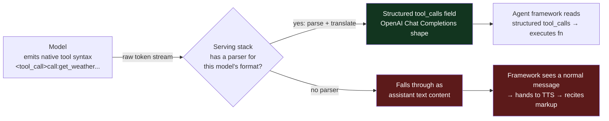
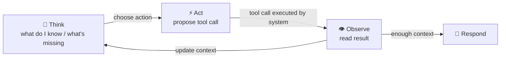

# LiveKit tool-calling posts vs. Kuralle runtime & Syrinx reasoner adapters

Analysis of three LiveKit blog posts against the Kuralle agents runtime (`@kuralle-agents/core` 0.13.0)
and Syrinx's reasoner adapters (`packages/aisdk`, `packages/kuralle`). Every claim is cited to a post
URL or `file:line`. Reconstructed diagrams are flagged; the source pages render mermaid client-side and
the scrape captured only "Loading diagram…" / loose labels.

Sources:
- P1 — "Your Model Isn't Bad at Tool Calling. Your Serving Stack Is." <https://livekit.com/blog/your-model-isnt-bad-at-tool-calling> (2026-07-06)
- P2 — "Async Tools for Voice Agents: Keep Talking While Work Runs" <https://livekit.com/blog/async-tools-voice-agents> (2026-07-07)
- P3 — "The ReAct Pattern for Voice Agents" <https://livekit.com/blog/react-pattern-voice-agents> (2026-03-23)

---

## 1. Thesis of each post

### P1 — the failure is in the serving stack, not the model

The recurring failure mode: a team picks an open model with excellent tool-calling benchmarks
(Gemma 4, Nemotron 3), wires it into a voice agent, and the agent **never calls a tool — worse, it
reads the tool call out loud** (`Agent: "call colon finish underscore conversation..."`). The claim:
tool-calling ability does **not** live entirely inside the model; it lives in the *pairing of a model
and the serving stack that hosts it*. The same weights can score 100% behind one endpoint and 0%
behind another. [P1]

Three systems must cooperate on every request that carries a `tools` array [P1]:

1. **Model** decides to call a tool and emits it in its own *native* syntax (OpenAI JSON, gpt-oss
   "harmony", Gemma's `<|tool_call>call:get_weather{...}<tool_call|>`, Nemotron XML-ish tags). Baked
   in during training.
2. **Serving stack** (the inference server behind the API) parses that native syntax out of the raw
   token stream and translates it into the structured `tool_calls` field of the OpenAI Chat
   Completions response.
3. **Agent framework** reads the structured `tool_calls` field and executes the function.

"LiveKit Agents, like most frameworks, only reads step 3's structured output. It deliberately never
scrapes tool calls out of text content — text-scraping every model family's syntax client-side would
be fragile and would break streaming. So the entire chain hinges on step 2." [P1] When the serving
stack has no parser for the model's format, the tag falls through as ordinary assistant text → the
framework hands it to TTS → the agent recites markup to a customer.

Why GPT works everywhere: OpenAI-format models emit OpenAI's format natively, so there is nothing to
translate on an OpenAI-compatible endpoint. Open models depend on whether *that specific provider*
configured *that specific model's* parser. A well-formed tag in your transcript proves the *request*
side is fine — the failure is entirely on the *response* path, so no tool-schema/description/decorator
change can fix it. [P1]

Reasoning models **fail twice**: a hybrid model (Nemotron 3) emits a thinking block before/inside the
answer, so the serving stack needs *two* parsers — one to split reasoning from response, one to extract
the tool call. Miss either and tool calling silently dies while conversation still works. Mitigations:
turn reasoning off for voice (`enable_thinking: false` / `/no_think`); if self-hosting, configure both
vLLM parsers (`--reasoning-parser`, `--tool-call-parser`). [P1]

**The one-curl diagnosis** [P1]: call the endpoint directly with one tool attached and a triggering
prompt, then look at where the call landed:

```bash
curl https://your-provider.example.com/v1/chat/completions \
  -H "Authorization: Bearer $API_KEY" -H "Content-Type: application/json" \
  -d '{
    "model": "your-model",
    "messages": [{"role": "user", "content": "What is the weather in Tokyo?"}],
    "tools": [{"type":"function","function":{
      "name":"get_weather","description":"Get the current weather for a location.",
      "parameters":{"type":"object","properties":{"location":{"type":"string"}},"required":["location"]}}}]
  }'
```

```jsonc
// ✓ Serving stack is doing its job
"message": { "content": null, "tool_calls": [{ "type":"function",
  "function": { "name":"get_weather", "arguments":"{\"location\": \"Tokyo\"}" } }] }

// ✗ No parser: the model's native syntax leaked into content
"message": { "content": "<|tool_call>call:get_weather{location:<|\"|>Tokyo<|\"|>}<tool_call|>",
  "tool_calls": null }
```

If the call text lands in `content`, stop tuning the agent — the endpoint has to change. Fixes: use a
provider that serves the model correctly (LiveKit Inference runs the parsers at the serving layer);
self-host with vLLM/SGLang per-model parsers; or prefer the provider's native API (Bedrock Converse
`toolUse`) when the OpenAI-compat layer is incomplete. [P1]

### P2 — async tools: keep talking while work runs

A normal `@function_tool` **blocks the conversation while it runs** — the runtime awaits the tool and
only lets the agent speak once it returns. For a 14-second refund backend that is dead air, and the
customer hangs up. [P2] The running call also never enters the chat context, so the LLM can't see it is
working and tends to call it again. [P2]

The design fact: **async is not a special tool type.** Any ordinary `@function_tool` is synchronous
until the moment it calls `ctx.update()`. Four mechanisms (all landed in `livekit-agents` 1.6.0,
2026-06-11) [P2]:

- **`ctx.update(message)`** — the fix, one line. The **first** call *hands control back to the LLM
  immediately, using `message` as the tool's synthetic return value, and marks the call non-blocking*.
  The agent voices `message` right away while the tool keeps running in the background. Later updates
  surface only when both agent and customer are idle. An `update_template` frames every update as
  still-in-progress so a phase change is never voiced as "done"; the `return` value is the only line
  that announces completion. [P2]
- **`ctx.with_filler(line|callable, delay, interval, max_steps)`** — a *second* progress channel that
  plays audio directly through `session.say()` during quiet gaps, **bypassing the LLM**. Covers the
  waits between the `ctx.update()` events that matter. [P2]
- **`ToolFlag.CANCELLABLE`** — opt-in. When any registered tool is cancellable the framework
  auto-exposes two companion tools to the LLM, `get_running_tasks()` and `cancel_task(call_id)` (you do
  not define them). `cancel_task` raises `asyncio.CancelledError` inside the running tool. Opt-in
  because most writes are unsafe to stop partway; `ctx.disallow_interruptions()` hardens a write so a
  cancel raises `ToolError` instead. **Interrupting ≠ cancelling**: a barge-in discards the tool's
  *result* but the tool code keeps running — only `CANCELLABLE` + `cancel_task` actually stops it. [P2]
- **`on_duplicate`** on `@function_tool`, detected by tool **name only**: `allow` (default) / `reject`
  (tell the LLM to cancel the running call instead of starting a parallel one) / `replace` (cancel +
  restart, requires CANCELLABLE) / `confirm` (send name+args back, ask to re-call). A refund uses
  `reject`. [P2]
- **`AsyncToolset`** — makes a running tool + its pending updates survive an agent handoff (otherwise
  pending updates are dropped on handoff). [P2]

### P3 — ReAct is the reasoning engine inside every tool call

ReAct (Yao et al. 2022, ICLR 2023) = **Think → Act → Observe → Repeat**: the LLM alternates explicit
reasoning with tool actions until it has enough context to answer. The key architectural insight: the
**LLM never executes tools directly — it *proposes* tool calls, and the surrounding system executes
them and feeds results back.** That separation is what makes ReAct safe, loggable, controllable. [P3]
This is the same request/response separation P1 leans on.

ReAct vs alternatives: Chain-of-Thought reasons but never acts; Function-Calling acts with implicit
reasoning; ReAct interleaves both. Modern voice agents "use function-calling mechanics (structured JSON
tool calls) with ReAct-style reasoning traces for observability." [P3]

The voice-specific problem is **latency: every think→act→observe cycle is dead air** (~500ms+ per
iteration × 2–3 iterations = seconds of silence). Mitigations [P3]: (1) tools return complete,
ready-to-speak strings, not raw rows; (2) pre-classify intent to skip reasoning; (3) **filler speech
during tool calls** (`session.say("Let me check that for you")`); (4) stream partial responses (start
TTS on the first sentence); (5) cap the toolset at 5–10, cap iterations at 3–5. LiveKit primitives:
`session.say()` mid-tool, `context.disallow_interruptions()` for critical writes, `ToolError` →
reason-about-failure-and-retry, `agent.update_tools()`, MCP toolboxes. [P3] The ReAct post does **not**
describe deliberate parallel tool execution — it treats the loop as sequential and even warns that "once
the tool list grows, the reasoning loop degrades fast."

---

## 2. Diagrams (reconstructed — flagged)

**P1 tool-call chain** — the source diagram rendered as "Loading diagram…"; reconstructed from the
three-system prose in P1:



**P3 ReAct loop** — source rendered as loose labels ("choose action / tool call / update context /
Think Act Observe"); reconstructed:



---

## 3. Technique-by-technique comparison

Legend: ✅ full · 🟡 partial/weaker · ❌ absent · ➖ not applicable / delegated

| # | Technique (LiveKit) | Kuralle runtime | Syrinx (aisdk / core) | Genuine gap? |
|---|---|---|---|---|
| 1 | **Read structured `tool_calls`, never text-scrape** (P1 step 3) | ✅ reads AI-SDK finalized `tool-call` part; `executeModelTool.js:41` emits from structured call | ✅ `from-ai-sdk.ts:128` maps finalized `tool-call` only; test `from-ai-sdk.test.ts:235` proves `tool-input-start` (partial args) is dropped, never scraped | **No — but all three share P1's failure mode** (see §4) |
| 2 | **Strip `<think>` reasoning before TTS** (P1) | Unverified (no `<think>`/reasoning strip found in `runtime/`) | ✅ `from-ai-sdk.ts` / test:235 drops `reasoning-delta` parts → never reach TTS | No for Syrinx; **flag** Kuralle |
| 3 | **`ctx.update()` — return control to LLM immediately, mark tool non-blocking, run in background** (P2) | 🟡 `interim` fires a *spoken* cue but does **not** return control early — `ToolExecutor.js:110-175` still `await`s the real result; the model turn blocks on it | ❌ no non-blocking-tool path; reasoner turn awaits every tool | **Yes — real gap in both** |
| 4 | **`ctx.with_filler()` — timed spoken filler during gaps, bypassing LLM** (P2/P3 `session.say`) | 🟡 `interim`/`interimAfterMs` (`effectTool.d.ts:10-11`) = single fixed string spoken once at `interimAfterMs` via `onInterim`→`text-delta` (`Runtime.js:122-127`) | 🟡 `latency-filler.ts` speaks a connective **at turn start** to hide LLM TTFT, not mid-tool; `tool_call_cue` "delayed" (`voice-agent-session.ts:1298-1304`) is an **event**, not speech | **Partial gap** — Syrinx cue is a notification, not audio |
| 5 | **`CANCELLABLE` + auto `cancel_task`/`get_running_tasks`** (P2) | 🟡 `interruptible` flag + `abortSignal` race (`ToolExecutor.js:135-143`) → barge-in aborts; **no** model-driven selective `cancel_task`, no `get_running_tasks` | 🟡 barge-in aborts the reasoner turn (`from-ai-sdk.ts:155-164` swallows AbortError); no per-task model cancel | **Partial** — nobody exposes model-initiated cancel of one background task |
| 6 | **`on_duplicate` (reject/replace/confirm) — same-name double-call guard in one live turn** (P2) | 🟡 durable dedup via `idempotencyKey` + journal replay (`executeModelTool.js:56-77`) = exactly-once on *replay*, not a live-turn duplicate guard | ❌ none | **Yes for live-turn** (Kuralle's is durable-replay, different axis) |
| 7 | **`disallow_interruptions()` around critical write** (P2/P3) | ✅ per-tool `interruptible: false` (`ToolExecutor.js:135`) | 🟡 interaction-policy / VAP barge-in gating (session-level, not per-tool) | Minor — Kuralle has per-tool |
| 8 | **Parallel / concurrent distinct-tool execution** | ✅ `parallelSafe` batching: `dispatchModelToolCalls` groups consecutive parallel-safe calls, runs via `Promise.all` (`executeModelTool.js:52-95`); serial gate otherwise (`ToolExecutor.js:37-50`) | ➖ delegated to the reasoner (Kuralle or AI SDK owns the tool loop); core consumes `tool-call`/`tool-result` parts | **LiveKit doesn't cover this** — Kuralle is *ahead* |
| 9 | **`ToolError` → reason-about-failure-and-retry** (P3) | ✅ `toolErrorResult(error)` fed back (`executeModelTool.js:29`) | ✅ `tool-error`/error → `error` ReasoningPart drives retry/`llm.error` (`from-ai-sdk.ts:149-153`) | No |
| 10 | **Per-tool timeout** | ✅ `timeoutMs` (`effectTool.d.ts:12`, `ToolExecutor.js:144-154`) | ➖ not a per-tool concept in core | LiveKit doesn't document; Kuralle ahead |
| 11 | **HITL / approval / suspend-resume** (P3 HITL) | ✅ `needsApproval` (`effectTool.d.ts:8`) + `paused`/`interactive` parts | ✅ `suspended` ReasoningPart (`reasoner.ts:54`); Kuralle `paused`/`interactive`→`suspended` (`from-kuralle.ts:267-282`) | No — both ahead of these posts |
| 12 | **Dynamic tools / MCP toolbox** (P3) | ✅ `buildToolSet`, workspace tools (`TOOLS.md`) | 🟡 `config.tools` static surface | Tangential |
| 13 | **The ReAct loop itself** (P3) | ✅ runtime tool loop | ✅ the Reasoner *is* the ReAct engine — AI-SDK `stopWhen`/`stepCountIs` (`from-ai-sdk.ts:44`) | No |
| 14 | **Updates survive agent handoff (`AsyncToolset`)** (P2) | ❌ | ❌ (delegate/suspend-resume is a different seam) | Minor (single-agent scope) |

---

## 4. The load-bearing Q1 finding: Syrinx & Kuralle share LiveKit's exact failure mode

P1's core claim maps **directly** onto both codebases, and neither is protected:

- Syrinx's AI-SDK adapter reads only the **finalized, already-structured** `tool-call` `TextStreamPart`
  (`packages/aisdk/src/from-ai-sdk.ts:128-135`) and **explicitly drops** the streaming
  `tool-input-start` partial-argument parts (`packages/aisdk/src/from-ai-sdk.test.ts:235-260`). It never
  text-scrapes — identical posture to "LiveKit Agents… only reads step 3's structured output." [P1]
- Kuralle emits tool calls from the structured AI-SDK call too
  (`runtime/channels/executeModelTool.js:37-50`), and its tools *are* AI-SDK `tool()` objects
  (`guides/TOOLS.md`). Same posture.

Consequence: **the parsing responsibility is pushed down to the AI-SDK provider adapter**
(`@ai-sdk/openai`, `@ai-sdk/openai-compatible`, Bedrock, etc.), which is exactly LiveKit's "serving
stack." If that provider's OpenAI-compat layer fails to parse the model's native tool syntax, the call
arrives as a `text-delta` and:

- Syrinx forwards it as `{ type: "text-delta", text }` (`from-ai-sdk.ts:124-127`) → straight into the
  TTS text stream → **Syrinx will speak the markup**, the exact "recites markup to a customer" bug. [P1]
- Kuralle likewise forwards `text-delta` (`from-kuralle.ts:239-247`).

So P1's mitigation is 100% transferable and there is nothing in either runtime that would catch it
today. Reasoning-block leakage (P1's "fail twice") is *partly* handled on the Syrinx side: `reasoning-delta`
is dropped before TTS (`from-ai-sdk.test.ts:235`) — but a tool call *emitted inside* an unparsed
reasoning block would still leak as text.

---

## 5. Q2 finding: is Kuralle's `interim` the same as LiveKit async tools? — No, it is weaker

Precise mechanics of Kuralle `interim` (`dist/tools/effect/ToolExecutor.js:99-175`):

1. On tool start, a `setTimeout(interimAfterMs)` is armed (line 110-119).
2. When it fires: `onInterim(def.interim, name)` speaks the fixed `interim` string
   (`Runtime.js:122-127` emits `text-start`/`text-delta`/`text-end`), **and** the pairing tracker is
   closed as `IN_PROGRESS` with an `inProgressPlaceholder` (`pairing.js:5-6`) — but that placeholder is
   only observability bookkeeping.
3. Crucially, `executeInner` **continues to `await` the real `execute()` promise** (line 125-160) and
   returns the *real* validated result (line 175). `ctx.tool()` therefore resolves with the real result,
   so `dispatchModelToolCalls` emits `tool-result` only when the tool actually finishes, and the model
   turn does **not** advance early.

Therefore Kuralle `interim` ≈ **LiveKit `ctx.with_filler`** (a single timed spoken filler during the
wait), **not** LiveKit `ctx.update()`. It lacks all three things that make `ctx.update()` "async":
early control return, non-blocking/background execution, and per-phase progress narration (it is one
fixed string at one fixed time). *(This is inferred from the compiled `dist`; flagged as code-read, not
runtime-observed.)*

Syrinx is weaker still on this axis:
- `tool_call_cue` (`voice-agent-session.ts:217`, `1293-1348`) is a **typed event** (started / delayed /
  complete / failed) that the *host/transport* may render as a "thinking" wire message — it does not
  itself speak.
- `latency-filler.ts` speaks a connective ("So," "Well,") but **at turn start** to hide LLM TTFT
  (`voice-agent-session.ts:1145-1150`), then splices it out of the real first delta
  (`latency-filler.ts:70-75`). It is not a mid-tool progress filler.

**Neither Kuralle nor Syrinx supports true background tool execution** (agent proceeds, real result
injected later). Both block the model turn on the tool. The nearest primitive is the durable
`suspended`/`paused` seam, which is suspend-*and-resume-later*, not keep-talking-now.

## Q3 finding: parallel tools

LiveKit's ReAct post does **not** cover deliberate parallel execution of distinct tools; it treats the
loop as sequential and warns about tool overload. P2's `on_duplicate` concerns the LLM firing the *same*
tool twice, not parallel distinct tools. **Kuralle has a genuine parallel primitive LiveKit's posts
don't**: `parallelSafe` batching (`executeModelTool.js:52-95`, `Promise.all`). Syrinx-core doesn't own a
tool loop, so it neither has nor needs this — it inherits whatever the reasoner does.

---

## 6. Adopt recommendations for Syrinx (ranked by opportunity cost)

**P0 — Ship a leaked-tool-call guard + the curl preflight (cheap, prevents reciting markup).**
The one-curl test (P1) should become a documented provider-qualification gate, and a runtime guard
should sit at the `text-delta`→TTS boundary in `from-ai-sdk.ts` / `from-kuralle.ts`: detect text that
matches known tool-syntax leakage (`<|tool_call`, `call:<name>{`, `<tool_call|>`, harmony/XML tags),
**suppress it from TTS and emit `llm.error`** instead of speaking it. This directly closes the §4 gap
that both runtimes have today. Low effort, high blast-radius reduction. Aligns with the "latency is top
priority" bar — it adds ~0 to the happy path (regex on already-streamed text).

**P1 — A true non-blocking / background tool path (the `ctx.update()` gap).** This is the one genuine
capability gap versus LiveKit and it is absent in *both* Kuralle and Syrinx. Design: let a tool yield an
early synthetic result that returns control to the reasoner while the real work continues, then inject
the real result as a later `tool-result` (or a follow-up turn). This maps cleanly onto the **Incremental
Unit substrate** already noted in project memory (add / commit / revoke) — a background tool is an IU
that is *added* (early synthetic ack), later *committed* (real result) or *revoked* (cancel). Do this as
an IU primitive, not a bolt-on, so speculative-gen, barge-in truncation, and background tools share one
mechanism. This is the founder-altitude "1": Syrinx's differentiator is orchestration across front×back
models, and non-blocking tools are the missing piece of that duplex story.

**P1 — Make `tool_call_cue "delayed"` optionally *speak* (LiveKit `with_filler` parity).** Today it only
emits an event; wire an opt-in that routes the delayed cue through the same `ttsText` path
`latency-filler` uses, with a per-tool filler string (Kuralle's `interim`/`interimAfterMs` is the shape
to copy: `effectTool.d.ts:10-11`). Small, self-contained, closes technique #4.

**P2 — Live-turn `on_duplicate` guard.** Syrinx has no same-name double-call protection within a turn
(technique #6). For any mutating tool (payment/refund analogues) add a `reject`-by-default guard keyed on
tool name for in-flight calls. Kuralle's durable idempotency (`executeModelTool.js:56-77`) covers replay,
not a live double-fire, so this is additive on both.

**P2 — Adopt Kuralle's `parallelSafe` batching semantics *if/when* Syrinx owns a tool loop.** Not needed
while the reasoner is a black box, but the `parallelSafe === true || replay === false` grouping
(`executeModelTool.js:32-34`, `52-95`) is the reference design and is ahead of LiveKit.

**No action needed:** ToolError-retry (#9), reasoning-delta stripping on the Syrinx side (#2),
suspend/resume + `needsApproval` HITL (#11) — Syrinx/Kuralle already match or exceed the posts.

---

## 7. Flags — things not verified

- **Kuralle `<think>`/reasoning stripping before TTS (technique #2):** no strip found in
  `dist/runtime/`; not confirmed. Syrinx's side *is* confirmed (drops `reasoning-delta`).
- **Kuralle `interim` does not return control early (§5):** inferred by reading compiled
  `ToolExecutor.js` control flow, not observed at runtime. Confidence high but not empirical.
- **P1 and P3 mermaid diagrams (§2):** reconstructed from prose; the scraped pages returned
  "Loading diagram…" / loose labels, so exact original node wording is not guaranteed.
- **Provider-level parsing behavior** (which `@ai-sdk/*` adapters correctly structure Gemma/Nemotron
  tool calls) was not tested — that is precisely what P1's curl test exists to determine per endpoint,
  and is the recommended P0 gate rather than an assumption to bake in.
