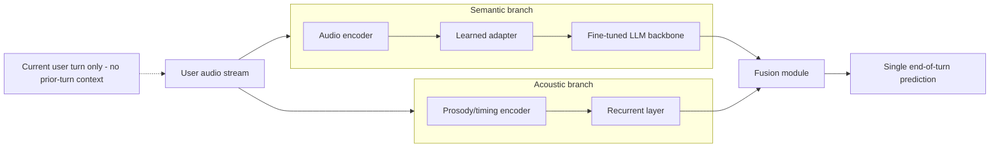
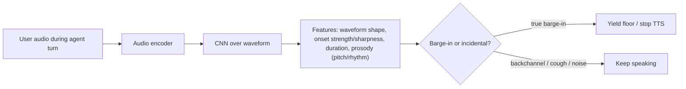
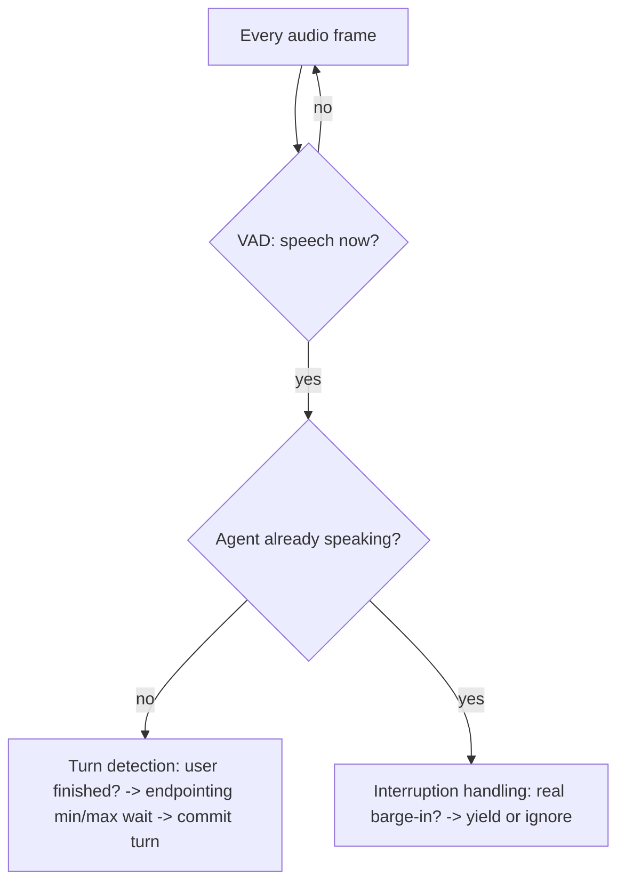
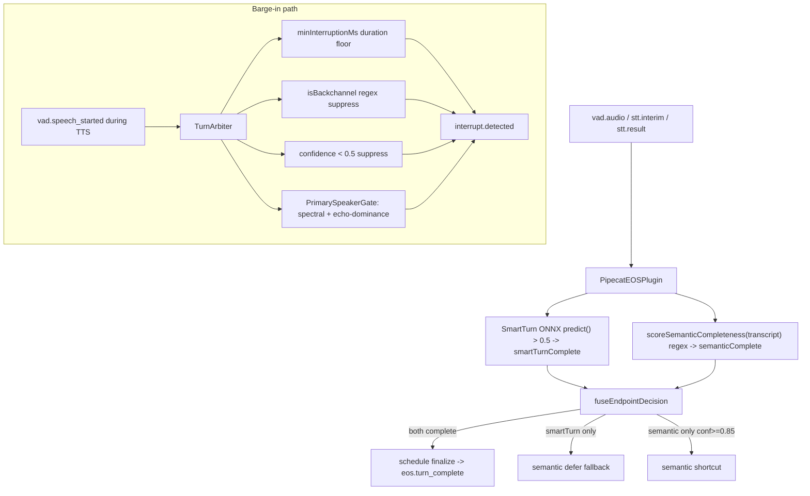

# LiveKit turn-detection / interruption cluster vs Syrinx turn-taking stack

Analysis date: 2026-07-21. Sources: six LiveKit blog posts (fetched via Firecrawl, full
markdown) cross-read against actual Syrinx code (`file:line` cited). Diagrams are
**reconstructed from the prose** — the blog's own diagrams are PNG/JS-rendered and were not
recoverable as source (flagged below).

## Sources (LiveKit)

| # | Post | Date | Core claim |
|---|------|------|------------|
| 1 | [solving-end-of-turn-detection](https://livekit.com/blog/solving-end-of-turn-detection) | 2026-06-17 | Turn Detector **v1**: listens to audio directly, fuses semantic+acoustic in one model |
| 2 | [improved-end-of-turn-model-cuts-voice-ai-interruptions-39](https://livekit.com/blog/improved-end-of-turn-model-cuts-voice-ai-interruptions-39) | 2025-12-12 | `v0.4.1-intl`: Qwen2.5-0.5B distilled from 7B teacher; −39.23% false positives; structured-data aware |
| 3 | [using-a-transformer-to-improve-end-of-turn-detection](https://livekit.com/blog/using-a-transformer-to-improve-end-of-turn-detection) | 2024-12-20 | Original EOU: 135M SmolLM2, transcript-based, 4-turn window, −85% interruptions |
| 4 | [turn-detection-voice-agents-vad-endpointing-model-based-detection](https://livekit.com/blog/turn-detection-voice-agents-vad-endpointing-model-based-detection) | 2026-02-21 | Concept primer: VAD vs endpointing vs model-based vs realtime |
| 5 | [adaptive-interruption-handling](https://livekit.com/blog/adaptive-interruption-handling) | 2026-03-19 | Audio+CNN barge-in model separates real barge-in from backchannel/cough |
| 6 | [turn-detection-and-interruption-handling](https://livekit.com/blog/turn-detection-and-interruption-handling) | 2026-06-30 | Config guide: modes, endpointing min/max, interruption options |

---

## Theses

**T1 — LiveKit v1 broke the exact ceiling Syrinx's *shipped* path still sits under.**
LiveKit's own framing: "text-based models, however good, share a ceiling. To break through it,
we had to stop reading and start listening" (post 1). Their v1 removes the transcript from the
loop entirely — an audio encoder + adapter projects speech into an LLM embedding space
(semantic branch) alongside a prosody encoder → recurrent layer (acoustic branch), fused into
one end-of-turn prediction. Syrinx's *shipped* fusion is precisely the two-signal transcript-
coupled design LiveKit deprecated: an acoustic ONNX model (SmartTurn v3, `eos-plugin.ts:252`
`predictor.predict`) fused with a **regex over the STT transcript** (`semantic-completeness.ts:56`
`scoreSemanticCompleteness`, combined in `fuseEndpointDecision` `:111`). The semantic half is
transcript-bound, so it inherits STT error, STT latency, and the loss of prosody — the three
structural limits LiveKit names.

**T2 — Syrinx already has the *architecturally-ahead* answer, but it is dormant.**
`packages/vap` (`VapInteractionPolicy`, DualTurn bundle) is an audio-native model emitting
`pShift` / `pBackchannel` / `pHold` (`vap-policy.ts:20`) — the same audio-in, fused
turn-shift + backchannel signal LiveKit ships as v1 (turn) **and** adaptive interruption
(barge-in), unified in one model behind a clean policy seam (`interaction-policy.ts:88`
`InteractionPolicy`). It is not "the equivalent that's unused by accident" — it is the correct
next generation, deliberately staged: **no weights are committed** (`vap/README.md` "Model
sourcing status: No model weights are committed. Use `StubVapPredictor`…"). Project memory
confirms MaAI MIT + DualTurn Apache-2.0 checkpoints exist and adoption is "dormant-but-armed".

**T3 — On barge-in, Syrinx has one capability LiveKit does *not* publish: speaker-identity +
echo gating.** LiveKit's adaptive model separates barge-in from backchannel/cough acoustically
but relies on **client-side echo cancellation** for the agent's-own-voice problem (post 4:
"Echo cancellation has to be handled on the client side"). Syrinx's `PrimarySpeakerGate`
(`primary-speaker-gate.ts`) locks a spectral fingerprint of the first user turn and, at
barge-in, rejects frames that match the assistant's playout profile more than the user's
(`shouldCommitBargeIn` `:76`, `echoDominanceMargin` `:36`). That is a server-side second-speaker
/ echo defense LiveKit's blogs don't claim.

**T4 — Syrinx *emits* backchannels; LiveKit only *detects* them.** LiveKit's whole adaptive
effort is about not mis-firing on a user's "mm-hmm". Syrinx also treats an agent-emitted
backchannel as a first-class decision (`interaction-policy.ts:84` `backchannel` with a cached
cue id; emitted during delegate/tool gaps in `rule-based.ts:120` and gated in
`interaction-coordinator.ts:193`). Different axis, and Syrinx is uniquely on it.

---

## Comparison table

| Capability | LiveKit technique (numbers) | Syrinx equivalent (`file:line`) | Verdict |
|---|---|---|---|
| **EOT model input** | v1 listens to **audio directly**, no transcript; semantic branch = audio encoder + adapter → LLM, acoustic branch = encoder → recurrent; fusion module (post 1) | Shipped: acoustic ONNX SmartTurn v3 `eos-plugin.ts:252` **+ regex-over-transcript** `semantic-completeness.ts:56`, fused `:111`. Armed: audio-native DualTurn `vap/` | **LiveKit ahead** on shipped path; Syrinx VAP is peer architecture but **dormant (no weights)** |
| **EOT fusion** | Single trained model fuses both signals | Two independent signals AND-ed: `fuseEndpointDecision` requires `smartTurnComplete && semantic.complete` `:124`; semantic-only shortcut at conf ≥0.85 `:141` | LiveKit ahead (learned fusion > hand-tuned AND) |
| **Confidence → wait mapping** | `endpointing.min_delay` / `max_delay`; `mode:"dynamic"` adapts within range to user's pace; example `min 0.3s / max 2.5s`; old default `min_endpointing_delay=500ms` (posts 3,6) | `confidenceToWaitMs` min **150ms** / max **2000ms**, monotonic, labeled "LiveKit-style" `confidence-to-wait.ts:10-29` | **Parity** (Syrinx explicitly modeled on this); Syrinx lacks per-session **dynamic** adaptation |
| **Barge-in classifier** | Adaptive model: audio encoder + **CNN**; features = waveform shape, onset strength/sharpness, duration, prosody. **86% precision / 100% recall @500ms**, rejects **51%** of VAD barge-ins, faster than VAD in **64%**, **≤30ms** inference, median **216ms** audio to trigger (post 5) | Heuristic gate: `minInterruptionMs` duration floor `turn-arbiter.ts:249`, `isBackchannel` regex suppress `:262`, low-conf (<0.5) suppress `:258`, spectral primary-speaker gate `primary-speaker-gate.ts` | **LiveKit ahead** (trained model vs heuristics); Syrinx VAP `pBackchannel` would close it but is dormant |
| **Backchannel handling** | Detects & rejects user backchannel; `backchannel_boundary` cooldown at turn edges so late corrections aren't dropped (post 6) | Detects: `SemanticCompletenessLabel "backchannel"` `semantic-completeness.ts:1,62`; `isBackchannel` set `turn-arbiter.ts:28`. **Emits**: `backchannel` decision `interaction-policy.ts:84`, `vap-policy.ts:66` | Detection parity; **Syrinx ahead on emission**; Syrinx **lacks** the edge-cooldown guard |
| **Speaker-identity / echo gate** | Not published; relies on client-side echo cancellation (post 4) | `PrimarySpeakerGate` spectral fingerprint + `echoDominanceMargin` 0.12 rejects assistant-echo & non-primary speaker `primary-speaker-gate.ts:76-92` | **Syrinx ahead / unique** |
| **STT-native endpointing** | `turn_detection="stt"` for Deepgram Flux / AssemblyAI; set `min_delay=0` so provider timing isn't double-counted (post 6) | `DeepgramFluxSTTPlugin` `flux.ts`: `eot_threshold` 0.7, `eot_timeout_ms` 5000; `endpointingCapability.owner="provider_stt"` disables local EOS `flux.ts:53` | **Parity** |
| **Eager / speculative EOT** | Flux `eager_eot` fires **150–250ms before** EndOfTurn (post 6 links Deegram) | `eager_eot_threshold` → `EagerEndOfTurn` → `eos.interim` → speculative gen; `TurnResumed`→`eos.retracted` cancels `flux.ts:16-21,207-224` | **Parity** (Syrinx wires it into IU substrate) |
| **Structured-data awareness** | v0.4.1 infers expected format from agent prompt (10-digit phone, `user at domain dot com`, address); holds turn to completion; Qwen backbone transfers cross-lingually (post 2) | `INCOMPLETE_PREFIXES` / `EXACT_INCOMPLETE` regex only `semantic-completeness.ts:27-45`; no format-expectation from prior agent prompt | **LiveKit ahead** |
| **Multilingual** | 14 languages, per-language `unlikely_threshold`; v1 SOTA in most (post 1,6) | English-only regex `semantic-completeness.ts`; VAP model would be language-agnostic | **LiveKit ahead** on shipped path |
| **Dynamic endpointing** | `mode:"dynamic"` adapts to fast vs slow talkers within min/max (post 6) | Confidence-driven only; no per-user pace adaptation | **LiveKit ahead** |
| **False-interruption resume** | Pause on VAD, wait `false_interruption_timeout`, `resume_false_interruption` replays from where it stopped (post 6) | **Truncation-to-heard-prefix (G25)**: reasoner messages rewritten to what was actually spoken/heard `voice-agent-session.ts:1231-1238`, `reasoner-session-store.ts:15`, IU ledger | **Different & arguably ahead** — Syrinx reconciles LLM context to heard prefix, not just audio resume |
| **User-turn limits** | `max_words` / `max_duration`, `on_user_turn_exceeded` hook (post 6) | Absolute per-turn cap `maxTurnDurationMs` 15000 `eos-plugin.ts:73,323`; no word-count limit | Partial parity (Syrinx has duration cap, not word cap) |
| **Open benchmark** | `eot-bench` + HF datasets; latency-vs-false-cutoff frontier across 14 langs (post 1) | Local `runs/` proof harnesses; no frontier benchmark | LiveKit ahead |

### LiveKit's own benchmark (post 1, `eot-bench`) — vendor-reported, flag as such

At a **300ms** latency budget, false cut-off rate: LiveKit v1 **9.9%** · Deepgram Flux **12.9%**
· ultraVAD **27.7%** · LiveKit v1-mini **27.8%** · **SmartTurn v3.2 35.2%** · AssemblyAI 49.4% ·
VAD baseline 55.6%. At 600ms: v1 4.5%, Soniox 5.5%, Flux 9.9%. Fixed-interruption budget: at 5%
false-cutoff → 543ms mean latency; at 10% → 295ms.

> ⚠️ **SmartTurn v3.2 is the same acoustic-model family Syrinx ships** (`pipecat-smart-turn`).
> LiveKit's bench puts it near the bottom (35.2%) — but this is **LiveKit's private benchmark**
> (they concede "every provider evaluates on private data"). Treat as directional, not neutral.
> Still, the direction agrees with T1: an audio-only acoustic model without a strong semantic
> branch trails a fused audio+semantic model badly, and Syrinx bolts a *regex* onto that
> acoustic model, not a trained semantic branch.

---

## Diagrams (reconstructed from prose — NOT verbatim)

The blog's figures are PNGs (v1 architecture, adaptive architecture) and one JS-rendered
mermaid (post 6 pipeline, captured only as "Loading diagram…"). Reconstructed faithfully from
the text descriptions.

### LiveKit Turn Detector v1 architecture (post 1)

### Adaptive interruption model (post 5)

### LiveKit pipeline decision (post 6, "Loading diagram…" — reconstructed)

### Syrinx shipped equivalent (from code)

---

## Answers to the four questions

**Q1 — v1 (audio-direct, fused) vs Syrinx SmartTurn+regex. Is LiveKit architecturally ahead?
Is VAP the equivalent or unused?**
On the **shipped** path, yes — LiveKit is architecturally ahead. Syrinx fuses a trained
acoustic model with a *regex over the transcript*, which reintroduces the STT-error / STT-latency
/ prosody-loss ceiling LiveKit explicitly left behind. Syrinx's VAP package **is** the correct
equivalent (audio-native, fused turn-shift + backchannel, one model, clean seam) — it is not
unused-by-accident but **dormant: no weights committed** (`vap/README.md`), so the runtime
default is `StubVapPredictor`. The gap is not design, it is a missing checkpoint export.

**Q2 — Adaptive interruption vs Syrinx backchannel label + primary-speaker gate. What does
LiveKit do that Syrinx lacks?**
Both separate real barge-in from backchannel/noise. LiveKit does it with a **trained audio+CNN
model** (86% precision / 100% recall @500ms, 51% VAD-barge-in rejection, ≤30ms); Syrinx does it
with **heuristics** — duration floor (`minInterruptionMs`), backchannel regex, `<0.5` confidence
suppression (`turn-arbiter.ts:246-265`). Two concrete things LiveKit has that Syrinx lacks:
(a) a **`min_words` guard** (require actual word content before interrupting — Syrinx has no
word-count floor); (b) **`backchannel_boundary`**, a cooldown at each turn edge so late
corrections aren't discarded. Conversely Syrinx has the **`PrimarySpeakerGate`** (speaker-
identity + echo gating), which LiveKit does not publish.

**Q3 — Concrete numbers/params LiveKit publishes that Syrinx should adopt.**
`min_endpointing_delay` default 500ms; dynamic endpointing example `min 0.3s / max 2.5s`;
adaptive model median trigger **216ms** / **≤30ms** inference / **500ms** overlap operating
point; Flux `eager_eot` fires **150–250ms** before EndOfTurn; OpenAI server_vad `threshold 0.7 /
prefix 300ms / silence 400ms`; STT mode `min_delay=0` rule; v0.4.1 fixed TPR **99.3%**. See
adopt list below for which map to action.

**Q4 — Where is Syrinx ahead?**
(1) **`PrimarySpeakerGate`** — server-side speaker-identity + assistant-echo rejection (unique).
(2) **Truncation-to-heard-prefix (G25)** — on barge-in, the reasoner's message history is
rewritten to what was *actually spoken and heard* (`voice-agent-session.ts:1231`,
`reasoner-session-store.ts:15`), vs LiveKit's audio-only pause/resume. (3) **Backchannel
emission** — agent-side "mm-hmm" as a first-class `InteractionDecision`, gated on caps / TTS /
user-speaking / asset presence (`interaction-coordinator.ts:193-219`). (4) The **`InteractionPolicy`
seam** itself (`interaction-policy.ts:88`) — turn-taking is a swappable model-agnostic policy;
LiveKit's v1/adaptive are Cloud-locked (v1 full model only on LiveKit Cloud, adaptive not
available self-hosted). (5) **IU substrate + eager-EOT speculative gen** wired through
`eos.interim`/`eos.retracted`.

---

## Adopt recommendations (ranked)

1. **Ship the VAP DualTurn weights — highest leverage.** The architecture already mirrors
   LiveKit v1 (audio-in, fused shift+backchannel). Exporting the checkpoint collapses the
   acoustic+regex two-signal fusion into one trained audio model and simultaneously upgrades
   barge-in (`pBackchannel`) to a learned classifier — i.e. it closes *both* the Q1 and Q2 gaps
   at once. Weights exist (memory: MaAI MIT + DualTurn Apache-2.0). Run
   `modal run scripts/modal/export_dualturn_bundle.py` (`vap/README.md`), wire `LocalVapPredictor`
   / `WorkersVapPredictor` as the default policy, benchmark against the shipped fusion.

2. **Add a `min_words` barge-in guard** to `TurnArbiter`. Cheap, high-value: require ≥N words of
   real transcript content (not just duration + non-backchannel) before committing an interrupt.
   Directly borrowed from post 6's `min_words` option. Insert alongside the existing suppress
   checks in `tryCommit` (`turn-arbiter.ts:246`).

3. **Add structured-input awareness to `scoreSemanticCompleteness`.** LiveKit holds the turn
   until an expected format completes (10-digit phone, `user at domain dot com`, address).
   Feed the agent's last prompt intent into the scorer so digit/email/address collection doesn't
   finalize mid-sequence. Real payoff in data-collection flows. (`semantic-completeness.ts`.)

4. **Add a `backchannel_boundary` edge cooldown.** A short window at each turn edge where a
   backchannel-looking interim is *not* discarded, so genuine late corrections survive
   (post 6). Complements the existing `isBackchannel` suppression rather than replacing it.

5. **Add dynamic endpointing.** Extend `ConfidenceToWaitConfig` (`confidence-to-wait.ts:3`) to
   adapt `min/max` within a session to the user's observed pause distribution — LiveKit's
   `mode:"dynamic"`. Snappier for fast talkers, more patient for slow ones, at zero model cost.

6. **Build a latency-vs-false-cutoff frontier harness** (eot-bench-shaped) over the existing
   `runs/` proof scripts, so VAP-vs-shipped and threshold sweeps are measured on the same
   frontier LiveKit publishes (false-cutoff % at fixed latency budget). Enables an apples-to-
   apples answer to the vendor-reported SmartTurn 35.2% figure.

7. **Confirm Flux STT-mode delay stacking.** LiveKit's `min_delay=0` rule exists because a
   framework endpointing floor double-counts on top of the provider's own timing. Syrinx's
   `endpointingCapability.owner="provider_stt"` + `disableConfig` (`flux.ts:53`) is designed to
   avoid this; add a regression assertion that the local `finalizeDelayMs` is *not* applied when
   Flux owns endpointing.

---

## Unverified / flagged

- **Benchmark numbers are LiveKit's own** (`eot-bench`, private methodology by their own
  admission). SmartTurn v3.2 = 35.2% and the v1 = 9.9% figures are vendor-reported; not
  independently reproduced here.
- **v1 / adaptive internal architecture** taken from prose + PNG captions only; the actual model
  graphs were not fetched (images). Mermaid diagrams above are reconstructions.
- **VAP checkpoint existence** is from project memory (`vap-adoption-unblocked`), not re-verified
  against a live Modal volume in this pass.
- **"SmartTurn v3" as Syrinx's exact acoustic model version** inferred from `pipecat-smart-turn`
  package naming + `probabilityThreshold` usage; the ONNX file version string was not opened.
- The post-6 pipeline mermaid was literally unrenderable in the scrape ("Loading diagram…");
  its reconstruction is from the surrounding numbered prose (VAD → finished? → interrupting?).
